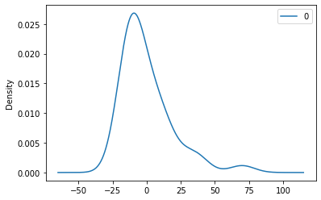

---
author:
  name: "Fedi Hamdi"
date: 2014-09-28
linktitle: Creating a New Theme
type:
- post 
- posts
title: Creating a New Theme
weight: 10
series:
- Hugo 101
---
![](data:image/jpeg;base64,/9j/4AAQSkZJRgABAQAAAQABAAD/2wCEAAkGBxISEhUTEhIWFhUXFhYYGBUVFRUXFhUYHxgWFhcVFxMYHSgiGBsnGxUXIzEhJSkrLi4uFx8zODMtNygtMSsBCgoKDg0OGhAQGy0lICUtLS8tLS0tLS0tLSstLS0tLS0tLS0tLS0tKy0tLS0tKy0tLS0tLS0tLS0tLS0tLS0tLf/AABEIAOEA4QMBEQACEQEDEQH/xAAcAAEAAgIDAQAAAAAAAAAAAAAABgcEBQECAwj/xABHEAABAwEDCAYHBwEGBgMAAAABAAIDEQQFIQYSMUFRYXGBBxMiMlKRI0JicqGxwRQzgpKiwtFDU3OTs+HwFRYkVLLSY2TD/8QAGwEBAAIDAQEAAAAAAAAAAAAAAAMEAQIFBgf/xAA9EQACAQIDBAgGAQEHBAMAAAAAAQIDEQQhMQUSQVETYXGBkaGx0QYiMsHh8BTxFSMzQlJiciRTgtKSssL/2gAMAwEAAhEDEQA/ALxQBAEAQBAEAQBACUBHr1y0sUFQZescK9mIZ5rsLh2QdxIUUq0I8Tp4fZGKrZqNlzeX58ERS8Ok6Q4QQNbsdK4uP5G0/wDIqGWJfBHXo/DsFnVm32Zeb9jWvygvefumRo2MjaxvJ7hX4rXpKrLSwOzaOqT7W2/Bex4G7LzkxfLL+O0OPwDiFjdqP+pJ/IwEMoxXdFex5OyUtbu89h96R5/aVjopG62lho6J+C9wMkbUND4xwe8ftTopD+1MO9U/Be53FzXizuTP/BaJB8yE3Jria/y8DP6oLvivyerL3viD15SBqc1koPE0J+KzvVUavC7MrcIrvcfZGdYuk60MObPBG/bml0bhxBzqnyWyxMlqivV+HaMlelNrts19vuSm6+kCxTUDnmF2yUUH+ICWjmQpo14PqORiNh4ulnFby/2+2vkSmOQOAc0gg6CDUHgQpjkSi4uzWZ2QwEAQBAEAQBAEAQBAEAQBAEAQHDjTE6ECVyG3/wBIMEVWWcdc/wAQNIh+P1/w4bwoJ10tMzu4PYVar81X5V5+HDv8CGzT3hePec4xnV93AOXr884qBudQ7cYYLAaL5vGX48jaXfkTG3GV5efC3st89J8wto0VxKlba83/AIat25v29SQWS64ovu42t3gCvN2kqVRS0ObUxNSp9cmzK6pZsRbw6pLDeHVJYbx1MSGd46mNDO8dDGsG28Y1qsMcgpIxrh7QB+aw0nqS0604O8W12Ggt+R8LsYy6M7O83yOPkVG6Seh0aO1ascpq/k/3uNMyz2+7yXwvcG6SYznMO98RHxI5qO04aF51MHjVu1Er9eT7n+e4lmT/AEmMdRtrZmH+1jqWH3mYlvKvJTQxHCRxsZ8PSjeWHd+p69z0fl3k/s87JGh7HBzXCoc0ggjaCNKsppq6POThKEnGSs1wZ6LJqEAQBAEAQBAEAQBAEAQGsv6/YbIzPldie6xuL3nY0fU4BaTmorMt4TBVcVPdprtfBdv7crC9L7tl5P6tgIj/ALJh7IG2V/rc8MMBVVJTlUdkesw+Dw2z4b8n83N6/wDiuHrzdjeXLkdFHR01JH7Kejbwb63E+QUkKSWpz8VtWpUyp/KvP8d3iSZsSlscpyO4iWbGu8d2wpYw5Hs2xOOqnFZsRutFHoLuOsjyWd016fqO3/Dh4j5JumP5D5A3a3afgm6P5D5HR117HfD/AFTdNlieo8JLrfqoVrus3WJjxMOayubpaR8vNYaJ41Iy0ZjOYsEqZ5OasG6Zob4ybhmq4Dq3+JowJ9pug8cDvUcqaZ0MNtCrSyea5P7MjtktlsuuSrTRpOIxdDJxGp1OBw2KJOdN5HTqUsLtGHzarukvx4rvLRyVyugtooOxMBV0TjjvLHeu34jWArdOqp9p5PaGy6uEd3nHg/fk/wBRIVKcwIAgCAIAgCAIAgCAjeV+VkdjbmNo+dw7LNTR4300DYNJ8yIqlVQ7TqbO2ZPFveeUFq+fUv3LyK9uy6p7wlM0z3ZpPakOk09SMaAB5DeaqtGMqjuz0tfE0cDTVKms+X3f7dk/u+744WBkbQ1o8ydpOs71YjFJWR5ytXnVlvTd2ZrWLYrtnvFCToCzY0lNIyo7IBpxW1iF1XwMhrQNAWSNts5QwEAQBAEAQBAY09hjdpFDtGCw4pksK048TU2u6ntxb2hu0+WtaOJcp4mMsnkat4WhcRi2mFr2lrmhzTpBFQVq0SwnKL3ouzIVfNwvs7hNZy7Naa4E58Z2gjEjfpGvaq8obuaO9hsbCuujqpXfgyc5DZci0ZsFpIbNoa/ANl5aGv3aDq2KxRr73yy1PP7V2M6F6tHOHFcY/j048ycqyefCAIAgCAIAgCAjWWmVDbHHmso6d47DToaNHWO3bBrPAkRVam4us6mzNnPFzvLKC1fPqX7l4EByduJ9reZ7QXFhcSST2pXa8dTdVRsoN1aEHJ3Z6PG4yOGiqVJZ+UV7/wBWWFDGGgBoAAFAAKADUAFZPNSk27s92hZI2Z0Fl1u8lskV51OCMsCi2ITlAEAQBAEAQBAEAQBAEBh267mSacHeIfXatXFMnpV5U+wjNvsj4jRw4EaCopJo6tKrGorxMF5WpYREMo7ipWWEb3MGrXnN/jyUE4cUdrBYy/8Ad1O5/Zkz6PMs/tAFmtDvTAdh5/qgaj7YHmMdqno1r/LLU4W2dk9A3Wor5eK/0/j0J4rJ54IAgCAIAgNZlFfTLJC6V+J0MbXF7zoaPKpOoArSc1FXLeCwk8VVVOPe+S5/vEqq6bFJb53TTuJbnVe7RU6o27BSnAbyqcYubuz1+IrQwVFU6Sz4e7/c2WDC0NAAAAAAAGAA1ABWkebk23dmRHjgFkieRtrLZs3E6fkt0inUqb2S0MlZIggCAIDo+Vo0lLmyi2eTrWNQWLm6pM8zbDsCxc2VI6G3HYPim8Z6FD/iO1vxTeM9B1noy8WHTUcR/CbyNHQmtDJY8HEEHgtiJprU7IYCAIDznha9pa4VB1LDVzaE3B3iRC+bsdCajFh0O2bjvUMo2O1hsQqqtxNQ5yjLqREb/u0xOE0VWioJzcDG6tQ5p1Y+R+EM42zR2sHiFUj0VTPt4rk/3MtHITKcW2Gj6CeOgkGjO2SNGw/Ag7lbo1d9Z6nkdrbOeEq/L9D06uru9CTqY5QQBAEBw40xOhAlcp3KK833law2M+jaS2PYG+tKeNK8A0aVRnJ1JZHuMFh44DDXn9TzfbwXd63ZLrBZmxMbGwUa0cztJ3kqZJJWRxa1SVWbnLVmY1y2IGje3fZMwVPePw3KRKxz61XedloZi2IAgCA8J7U1uGk7P5WGySFNyMGS1k6+QWtyeNJI8usWDfdODIhndOhkQ23ToZFgyonm6RDdRPN0iwbJHRs5aatJB3Jc2cE1Zmwsl+UwkH4h9R/C2U+ZVqYPjDwNzFIHAFpBB1hSFGUXF2Z3QwEB0mia9pa4VBwIKNXNoycXdakDv27TA+mlh7rvod4Vacd1nocJiFWj1rU08tCCCKg4EHQRsUZejdO6I1ZLVJd9qbLHiBqr32HvMP8AvSGlRJuEro6lSnDHYd05/wBHwf71ovS77ayeJksZqx7Q5p3HaNR1ELoxkpK6Pn1ajOjUdOazTsZCyRhAEBDOk2++qgEDD25qh26Md783d4Z2xQV52VuZ3dhYPpa3Sy0j/wDbh4a+BHck7B1cfWOHaf8ABuoc9PlsUVONlc6e0K/ST3FovUkDXqQ5rRu7jslfSO0er/KkguJQxVW3yLvN0pCgEAQGrtt5eqw8Xfx/K0cuRbpYfjI13WLUtbo6xBunHWIN04MiwZ3TvBE9/dFd+rzWUmzWcow+pmfFdHjdyb/J/hbbpWliv9KMpl2xD1a8SVndRE8RUfE7/YYvA3yWd1GOmqczzfdcJ9TyJHyKxuo2WJqLiYVouBp7jyOOI+i1cCeGNkvqVzX9VaLKc4DObrpi08RpHFa/NEs71DEqzyfmb+7reyZucw8Rrad6ljJM51ajKlK0jKWSEIDFvKxNmjMbteg62nU4LEldWJaFaVKanErG3wuie6N4o5pofoRuIx5qm1Z2PWUpxqQU46M1N6WfrGEaxi3js5rSSui5Qn0cr8OJveiS/S1zrHIcDV8VdTh94zmO1Tc9SYadnus5/wARYK8ViY8MpdnB/bwLRVw8kEAJQFK3javt9uc/THWjf7puA/Np4vKoSe/O57ujS/hYNR48f+T9vsShr1MclozLuhMrwwa9J2DWVmKu7EFaapwcmTRjAAABQAUAVg4TbbuzshgIDS3zeWJjYfeP7f5UcpcC/hsP/nl3GoEi0Lu6OsS5jdHWIN04z0M7purBdPrSfl/n+FJGPMoVsTwh4m3a0DACgW5TbvqcoYCAIAgCAIDW2i7KP62GjJNY9R42OA0cR8Vo48UWoYi8dypmvNdnsZ0MmcK0IOsHSDsWyK8o7rseiyahARTLy686MTtHaZg7ezbyJ8idihrRyudjZOJ3Z9FLR6dv5K9c9VT0qRp55nQTsnjwc1wePeBqQdx18StHdO6LsIRrUXSno1bu/Bfl221s8UcrO69rXDgRWh3rpRkpJNHzqtSlRqSpy1TsZKyREey9vLqLFIQaOk9E3Ghq7AkHaGZx5KKtLdgzp7Iw/TYqKeizfd+bIrjJmHNY5+txoOA/1r5KrTXE9Pjp70lHkb0SKQ57iS7JSy0jMh0vwHuj+TXyCnprK5xdoVLz3Fw9TeqQ54QGuvu8OpZh3nYN3bXcvqFrOVkWcLQ6Weei1Il1qgO1unPWoY3R1qDdHWIN0k9y3ZmAPeO2dA8I/lTRjbNnJxWI33ux09TbLcphAdXnA8EMrUwblvITx19YUDhv28CtYyuixisO6M7cOBsFsVggCAIAgCAIAgOssYcC1wqCCCDrBwIQzGTi01qil76shs80kR9V1AdrTi0+RCoTW67HusLVVelGouK8+Pmaa3jOad2P++SjZeo/LIsbohvPPs0kBOML6t9x9XD9Qf5hWsNK6ceR5j4jw+5XjVX+Zea/FieqyedKz6W7dWSCAHutdIRvJzGH9L/NVMTLNI9V8O0bQnVfFpeGb+xrbIMxjW7ABz1/FaLJFup80nIy4AXOa0aXEAcSaBbLMhnaKcnwLPs8IY1rBoaAByFFbSseSnJzk5PieiyahAV/f16tfK5xcA0dltSBgNfM1KrTldnpMJhnCmklnqzUvveIeuOVT8lpvouLC1HwPJ1/xDRnHgP5Kxvo3WCqPkeTsom6mO5kBY6Q2WAlxaJTkM02gumcyjGGjamuc/STSmgYczuU1L5szk7VaoJUk7t69S/Pp2k3Vg4AQBAdJj2TwPyRmY6oqW58rmwvbIGvpTtN7PabrGnSqUatnc9nidlurFwbXV2lrWG1smjbJG7OY8Ag7uGo7tSuJpq6PH1aUqU3Cas0e6yRhAEAQBAEAQBAV10q2LNdFOPWrG7iKvZ8M/yCq4iOjPT/AA/Wup0nwzXo/sV6+RVT0qibzovt3VXg1mqVr491QM9p/RT8SkoStO3M5+3qPSYNy4xaf2fr5F1roHgymMtbR1t5SbGuYwcGtaSPzFyoVXeoe52XDo8DHrTfi/ax2EiDdN7kbF1lqb7Ac/y7I+LgpaSvI5205bmHfXZfvgWQrR5cIDS5ZXiYLHK8Gji3MaRpDnHNBHCpPJR1ZbsWy/syh02JhF6avsWfnoUqFQPdnNUMHKA7RRlzg1oq5xDWjaSaAeZWVmayainJ6LMvS57vbZ4Y4W6GNArtOlzuZJPNdCMd1WPn+JruvVlUlxf9F3IzFsQBAEB0n7ruB+SwzaP1I+eI9A4Bcw+ly1ZMujzKX7PJ9nlPopHdkk4RyH5NdoOw0OslT0Km67M4e2dn9PDpoL5o69a916dxbCunjjDvG9YIBWaVkezOcATwbpPJayko6sno4atWdqcW+xERvTpMs7KiCN8p8TvRs+Izv0qGWIitDs0Ph6tLOrJR837eZ3yOvi22+QyyFsdnYaZsbSOsfqbnkkkDSSKVwG2ilOc3d6GNpYXCYKChC8pvi3ouduvhrz5E3Vg4AQBAEBHOkGydZYJtrAJBuzCHO/TnDmoqyvBnT2PV6PGQ68vHJedij3SLnnv1E9bptfVWiGWtMyWNx4BwJ+FUi7NM0xFLpKE6fNNeR9HLqnzAoK8rTW1TSHGs0x83up8FzZP5mz6LQp/9PCC/0x9EeUluedGHDT5rF2bqjFak46JISZLRIdTY2gneXlw/S1WcMs2zgfEUrQpwXNv0t6sspWjywQEA6WbVRkEXic95/CA0f5h8lWxDySPR/D1O8qlTkkvHP7FcgqqenOaoAgJH0f2PrbbHXRGHSHkM1v6nNPJS0VeZy9sVejwkrcbL7+iZcKvHiQgCAIDpP3XcD8lhm0fqR87x90cAuYfTJasFAjdz5XW10bY/tDmta0N7NGvcBgC6TvV3ghSOrO1rlCOy8JGbnuJtu+enctPI0b3EkuJJJ0kmpPEnSoy+lZWWhnXBc8lrnbDHhXFztTGDvOPnQDWSFtCDk7Ir4vFQwtJ1Jdy5vl79Ret3WGOCJkUTaMYKAfMk6yTUk6yV0YxUVZHz6tWnWqOpN3bMlZIggCAIDwt1nEkb4zoexzTwIIPzWGrqxJSm6c4zXBp+B82DQuSfUmdX6CjzMotL/nYeP4q30x5D+yHyK+lfnOJ2knzNVXZ6WKskjgIZLQ6I2+gnP/zAeTGH9yuYb6WeS+In/fQX+37v2J4rB54ICrelaWtqjbshB/M94/YFTxH1I9d8Pxth5S5y9EvchagO6KoYOaoCd9E0dZbQ7W1kY/MXH9gVjDrNs898QytTprm35W9yylbPLBAa287+s1n++mY0+GtX8mNq4+S1lOMdWWqGCr1/8ODfXw8dCJ3n0lxios8Ln+1IcxvENFSedFBLELgjs0Ph6bzqzS6lm/b1IlemWFtnqHTFjT6sQzB+bvcs5QyrTfE7NDZWFo5qN3zln+PI0CiOicIZOpQHLGFxDWglxIAA0kk0AA2kokG1FNvRF15F5OCxQUNDM+hkcNupgPhbXmSTrV+lT3F1ng9p494urdfStF9+1/gkKlOaEAQBAEAQHzferM2eZuyWQeT3Bcp6s+oYd71GD/2r0RiLBMcIZM97aEjYSFsVk7q4WDJafRGf+mm/vz/lxK7hvpZ5D4i/x4f8fuydKwefCAqfpUH/AFrT/wDXZ/mSqniPqPY7Af8A0r/5P0iQ9QHbOaoYCAsDojPbtXuwfOb+VZw3E858RfTS/wDL/wDJY6tHlzUZQXK60toLTNDujcA0+8AASN1QtJw3uJdweLWHld04y7de7h5FdXn0fWuKpjzJh7JzX7yWOw8nFVZUJLTM9NQ25hqmU7xfXmvFeyIva7M+J2bIxzHbHtLSeAOkb1C01qdenUhUW9BprqdzxJWDc4QycEoDhYMm0yXvRtltUcz2BzWkg4VLQRQvb7Q+VRrUlOSjK7KmPw0sRh5U4uzfnbg+pl7Qyte0OaQ5rgCHDEEEVBB2UXRTufPZRcZOMlZo7oahAEAQBAEB85X6a2m0f383+Y5cqWr7X6n07Cf4FP8A4x9EYJWCycIDb3tHm2iZvhmlb5PcPot5ZSZSw73qMHzjH0RjBakpZnRBMMy0M1h7HfmaW/8A5q3hnk0eV+I4fPTl1NeD/JYStHmggKy6W4aSwPp3mPbX3XNP7yqmJWaZ6v4dnenUjyafjf2IHVVj0RyhgICadFVpzbVIzxxE82uFB5Od5Kxh381jhfEFO+HjPlL1X4RaiuHkAgCA8rTZmSNLZGNe06WuaHA8QVhpPU3hUlTe9BtPmsiLXvkBY5AXMDoXYn0Z7J/A6oA4UUUqEXodfDbcxUGlK0l16+K+9yoGuqAdoVE9q1Z2CwDgrIOFgyWB0ZZT5jhY5Xdlx9C46naTHXYdI31GsKzQqW+Vnm9u7O3l/JprNfV2c+7j1Z8yz1cPJhAEAQBAcEoD5ptM2e9z/E5zvMk/Vcm98z6pCG5FR5JLwPJxWGbonX/JO4/FWOhPPf2w+Zr8urN1dvtApgXB435zWuJ/MT5LWsrTZa2TU38HTfJW8G16GiUZ0CcdE1qzbVJH44q82OFB5Pd5Kzh381jgfENPew8Z8peq/CLXVw8cEBDelOxZ9kEg0xSNJ911WH4uaeSgxCvG53NgVtzEuD/zJ+Kz+zKmVI9ic1QCqA2WTl4/Z7VDMTRrXjO9xwLHnk1xPJb05bskyrjaHT4edNatZdqzXmXwuifPAgCAIDzn7ruB+SwzaP1I+c4u6OA+S5Z9OlqzMuy75LRKyGIVe80GwDW524DFbRi5OyIa9eFCm6k9F+27WWnN0cWN0bWgyNeGgGRrsXHW5zHVbidgCufx42PIx2/iozcnZp8GtO9WZFr16NbUypheyYbD6N/AAktPHOChlh5LTM62H+IMPPKonHzXv5MiV4XfNZzSaN8RrgXAtFdPZfoJ3gqCUXHU7VGvSrq9OSl2fde5b2QWU32yHNefTxgB/tjVIBv17DuIV6jU31nqeK2vs/8Ai1d6P0S06ur26u8lKmOQEAQBAa3KW2dTZJ5NbYnke9mkN+NFpUluwbLWBpdLiacOcl4XzPnYBcs+mntd9m62WOL+0kYz8zg36rNruxHWqdHTlPkm/BXPpLqm7AurY+W7zKt6XLFm2iGYaHxlh2VY6o5kSfpVTErNM9d8O1r0Z0+Tv4/08yCKsehNtkpb+otkEhOAeGu911WEncA6vJb05bskyntCj02GqQ42y7Vn9rF9LpHzsVQGLedjbPDJE7Q9jmndUUqN40rEldWJaFV0akakdU0ygbRA6N7o3ijmOLXDeDQ/ELmPJ2Po8JxnFTjo813nSqGQgCGS4uj2+/tFlDHH0kNGO2lvqP5gUrtaVeoz3o9h4fbOE6DEOSXyyzXbxX7waJTVTHJFUAqgPOfuu4H5LDNo/Uj5yi7o4Bcs+ny1ZcvR/k19ki6yQenkAzq/026RHx1nfhqCvUae6rvU8PtjaP8AJqbkH8kdOt8/bq7SWVU5xhVAdZGBwIcAQdIIqDxCGU2ndGmiyWssczZ4Y+pkbriOa1w1tdH3SDwroxqAo+iinvLIvS2liJ0nSqS3ovnm+1PXzN3VSFAVQCqAVQEH6XLwzLGIgcZpGinst7ZP5gwc1WxMrRtzO/8ADtDfxTqcIrzeXpcpsqke3JR0aWHrbwi2Rh0h5DNb+pzVLQV6iOVtyt0eCl/usv3uTL0XRPnxFOku7uusTnAdqEiUcBUP/Q5x5BQ4iN4dh19iV+ixSi9JZe3nYppc89vcEVWRcvTJC9ftNkikJq6ma/329lx50rwcF0act6KZ8+2jh/4+JlBaarsensbmq3KIqgKw6UbkzJBamDsyUbJTU8CjXHi0U4tG1VMRDPeR6zYOM3oPDyeazXZxXc/XqIKqx6G4QXCC5s8nL6fZJ2ytqRoezxsOkcdY3jZVbwnuO5UxuFjiqLpy7nyf7qXfYLayaNssbs5jxUH6EaiNBGohdBSTV0eCrUp0puE1Zo96rJEKoDpOey7gfkjNo/UirujDJrrS21St7DKdUD67x6/Bp0e17qp0Kd/mZ63b20ejvh6bzf1dS5d/Hq7S1Kq4eQFUAqgFUAqgFUAqgFUAqgKW6UL16+2FjTVkDcwbM89qQ+dG/gXPxE7ztyPdbBw/Q4Xfes8+7h795EFCdu5anQ3dmbHNaCO+4Rt91uLiOLnU/ArmFjk5HkfiTEb04UVwV32vTy9Sx1bPMnWWMOBa4VBBBB0EHAhDMZOLTWp8/X3drrNPJA6vYcQCdbdLHc2kc6rlTjuyaPoeGxCr0Y1VxXnx8zCWpPcmvRhfPVTus7j2JsW7pAP3Nw4taNasYednu8zg7dwvSUlWjrHXsfs/Vlq1V08gKoDHvCxsnjfFIKseKEfUHUQcQdoWrSasySjWnRmqkHmikb9uiSyTOik1YtdqezU4fUaiCqE4uLsz32ExcMTSVSHeuT5e3Ua9aFkIAguSDJHKh9ifQ1fC49pmsHxsrr3a/ipadXcfUc3aOzo4uN1lNaP7Pq9C3rvt8c8YkieHsdoI+II0gjYcVdUk1dHi61GpRm4VFZoyKrYiOHYgjbgsGU7O50s0LY2NYwBrWgNa0aAAKAIrJWRmdSU5OUndvU9Koa3FVkCqAVWAdXyAAkkAAVJOAA1knUEuZSbdkdLNaA9oc3unuk4Zw1OpsOpE7m04OD3XqetUNBVAarKa+RZLNJMdIFGDxPODR54ncCtak9yNy3gcK8TXjTWnHqXEoKR5cS5xq4kkk6SSaknmuYfRkklZaHEUTnuDWCrnENaBrcTQDmSE7BKainKWizfYfRVw3Y2y2eKBvqNAJ2u0udzcSea6sI7sUj5xi8Q8RWlVfF+XBdyM9blcICvele5M5jLWwYsoySngJ7DuTiR+PcqmJhlvI9FsLF7snQlxzXbxXevTrKxVI9Nc7MeQQWkggggjSCDUEbwQsmHZqz0LtyUvwWyztkwDx2ZG7HjWBsOkcdy6FOe/G54PaGDeFrOHDVdnutGbiq3KIqgNTlLcUdsizH9lwqWSUqWO+rTrH1AK0nBTVi7gcbPCVN6Oa4rmvfkym70u6WzyGKZua4c2uGpzXa2nb8jgqMouLsz29DEU68FOm7r06n1mKtSa4QXOEFzPua+Z7K/PhfSveacWP95uvjgd63jNxeRXxOFpYmO7UV+viux/qLIuTL+zSgNm9A/2jWM8JPV/FTiVahXi9cjy+K2JXpZ0/mXVr4e1yWRyBwBaQQdBBBB4EKa5xmmnZnaqXMCqXAqlwKoCPX5lpZLNUF/WPH9OKjiD7Tu63ma7io51oxOlhdk4nEZpbq5vLwWrNfc8VpvAtntY6uzAh0dmFfSHSHyk4uaNIBoDgaU72kd6pnLTkWcTOhgU6WHe9U0c+XVHk+fLnfSYVU5xBVAKoCnekbKH7TP1UZrFCSBTQ+TQ5+8Dujmdao16m9Ky0R7fYuC/j0d+a+aXkuC+77uRESoDs3J10T3F1s5tLx2IcG7DKR+1prxc1WcLC8t58DhbdxnR0lRjrLXs/L9GXAugePCAIDztMDZGOY9oc1wLXNOggihB5LDSaszaE5QkpRdmihspLmfY7Q6F1SBixx9dh7p46jvB3Ll1IOErHusJio4mkqi71yf7p1GsWhZubfJi/HWOYSDFho2RnibtHtDSOY1renPcdynj8HHFUtx6rR8n7Pj+C6LLamSMbJG4OY4AtcNBCvppq6PC1KcqcnCSs0etVk0FUBrr8ueG1x9XK33XDB7DtafpoOtazipKzLOFxdXDT36b7VwfaVXlFktPZCXEZ8WqVowHvj1D8N6pTpuPYewwW0qOKVllLk/tz9eo0VVGdC4QXCC5wguZFht80JrDK+PX2HEA8WjA81lSa0ZFVo06qtUin2o3tmy8tzBQyMf78bf2ZqkVeaOfPY2Dk8otdj97mUOki2eCz/kk+XWLb+RPqIv7BwvOXiv/AFPCbpCtzhgYmb2R4/rc5Y6eZJHYeEX+p9r9kjUT3nbLW4Rulllc7ARtJoeMbaNpvIwUblOeVy7HD4XCx31GMUuP5eZN8lMgmxFstqo54xbEMWMOou8bt2gb8CrFOhbOR5/aG23UvToZLi+L7OS8+wndVZPPnFUAqgIX0iZUdQw2eF3pnjtOB+6Yd+p7ho2DHZWvXq7q3Vqd3Y2zumn01RfKtOt+y4+HMqeipHsbnvYLE+eVkUQq97s1o37TsAFSTsBW0YuTsjSrWhSg5z0R9BXBdLLJAyCPQ0YnW5xxc47ySV1YQUI2R4DFYiWIqupLj5LgjYLcrhAEAQEey1ycFtgo2gmZUxOO3WwnwuoOBAOpQ1qW/HrL+z8a8NUu/pevv2r8FJyxuY4tcC1zSQ5pwIIwII21XMeWTPZRkpJNO6OqGbklyNyodZHZklTA44jSYz42jZtbzGOmWlV3MnocvaWzlio70Mprz6n9n3PLS2IZ2vaHMcHNcAQ4GoIOgg61dTueOlGUW4yVmjvVDUVQHBQXItfWQ1mmq6P0Lz4BVhO+PV+EhQzoxemR18NtqvSyn8y69fH3uQ28sibZF3WCVu2M1PNhoa8KqCVGaO5Q2xhqmr3X1++noR+0QujNJGOYdj2lp8nBRPLU6UJxmrwafY7+h51Q2CC51LhtS5nM2NhuK1Tfd2eQjaW5rfzvoPitlCT0RVq43D0vrmvG78Fdkquno5eaG0yho8EWJPGRwoOQPFTRw/8AqZyMRt+Kyoxv1v2XuuwnN1XTBZm5sMYYDpOlzveecXc1YjFR0PP4jFVcRLeqyv6LsWhm1WxAKoBVARvLHKttjZmMo6dw7LdTB437tg18KlRVaqgus6mzdmyxUt6WUFq+fUvu+BT88znuc97i5ziS5x0knSSqLd82e1hGMIqMVZLRHkSsG5cHRpkqbPH9ombSaRvZaRjFHpoRqc7AnZQDaujhqO6t56s8ntfaHTS6KD+Veb9lw8eROVaOIEAQBAEAQEH6Qcj/ALQDaIG+mA7bB/VaNY9sDRtGGoKriKG980dfU7OzNo9F/dVH8vB8vx6a8yqFzz09wgub/JfKiSxnNNXwk1LK4tOtzCdB3aDu0qWnVcOw5uP2dDFK6ylz+z99V5Fp3beUVoYJInhzT5g7HDSDuKuRkpK6PI16FSjPcqKz/dDKqskIqgFUAqgOHgEUIqNhxHkhlNrNGBNclleaus0JO0xMr50WrhF8EWI43ERVo1JeLPMZO2P/ALWD/CYfosdHDkjb+fiv+5LxZm2exxR/dxMZ7jGt+QWySWhBOtUn9cm+1tnvVZIxVAKoBVAKoCH5WZbMgrFZyHy4gu0sj4+J27QNewwVKyWUdTt7P2RKtapWyjy4v2XX4cyr55nPcXvcXOcauc41JO0lU2282esjGMIqMVZLRHmUNrlh9HGRueW2u0N7Ao6GM+udUrh4fCNenRStzDUL/PLuODtXaW6nQpPPi+XV28/AtRXzzQQBAEAQBAEAQEFy5yI6/OtFmAE2l8eAEu8ag/4HXtVSvh975o6nZ2ftLorU6v08Hy/HoVU9hBIcCCCQQQQQRpBB0HcqB6NSTV0cLBm5l3ZeMtnfnwvLXa9jhsc3QQtoycXdENehTrx3KiuvTsLCuLLqGWjZ6RP8X9N34vU54b1ZhXT1yPNYvY9Wn81L5l5/nu8CWNeCKg1B0EaDzU9zjPLJnNUAqgFUAqgFUAqgOKoBVAKoDX3vfcFmFZpA06mjF7uDBjz0LSU1HUs4fCVsQ7U436+HiV1lFltNaKsirDEdND6R49pw7o3DzKqzrOWSPTYLZFKh80/ml5LsXHtfgiK0UJ17nBKGSxMhcgi/NtFsbRmBZC4Yv2OkGpvs69eGBu0MNf5p+Bw9obV3b06Lz4vl2dfX4FphXzzYQBAEAQBAEAQBAEBGcrMjobYM8ejmAwkAwdsbIPWG/SOGCgrUI1M9GX8HtCeH+XWPL2Kkvi557K/q52Fp1HSx42sdr+Y1gLmzhKDtI9LRxFOtHeg7+q7TAWhNcILmwuq+rRZvupC0eA4sP4DgOIoVtGco6FbEYSjX/wASN3z4+JLbu6QxgJ4fxRGo/I44eZU8cRzRxq2w+NKXc/dexIbHlTY5NE7WnZJWM/rpXkpVVg+JzKmzsTT1g32Z+hto5Q4VaQRtBBHmFvcpyTjk0dqoYFUBzVDFzDtd6wRfeTRs3Oe0HyrUrVzS1ZPTw9ap9EW+40Vvy8srMGZ8p9lua3m59PgCo3XitDoUtjYif1Wj25+hFb0y6tUuEebC32MX/nP0AUMq8npkdehsfD085/M+vTw92yMyPLiXOJJOkkkk7yTiVFc6yslZaHRYM3Pew2KSZ4jhY57zoa0Y8TqA3nBbRi5OyNJ1Y04703ZFrZH5AMs5E1ppJMKFrdMcR2ivedvOjUNa6FHDKOcs2edxu1JVfkp5R837InCtnICAIAgCAIAgCAIAgCAIDHt9hjmYY5WNew6WuFRxGw7wsSipKzN6dSVOW9B2ZXOUPRq5tX2N2cP7KQ0cNzJDgeDqcSqFXCPWHgdvD7WTyrLvX3Xt4EDtlkkicWSscxw9V4IPEV0jeMFTacXZnXhUjNb0XdHisG1wgucILnLCWmoNDtGB8wgburMyW3nONE8w4SyD5FZ3nzZC6FF6wj4L2Oxva0/9zP8A40n/ALJvy5vxH8ah/wBuP/xXseE1qkf35Hu957nfMrF2bxhCP0xS7EjwAWCTeCC5wgudoo3OcGtaXOOhrQS47g0YlZV27IOSSu9Ca5P9G88tHWk9SzwihlP0Zzqdyt08JKWcsvU5eI2tThlT+Z+X5/cyzbmuWCyszIIw0azpc47XOOJV+FOMFaKODWxFStLem7mwW5CEAQBAEAQBAEAQBAEAQBAEAQGNb7BFO3MmjbI3Y5oPMV0HetZRUlZo3p1J03eDsyG3r0ZWd9TBI+I+E+kZ8TnD8xVWeDi/pdjp0trVI5TV/J+3kRS8Oj63R91jZRtjeK03tfQ8hVVpYWotMy/T2nQlq7dv4uR613bPF97DIymt7HNHmRQqCUJR1TLkK0J/TJPvMQOG1aXJDlZMXOEFzglYuZPay2SSX7qN8nuMc/8A8QVsoylojWVSMfqaXa7G/sGQlvl/oiMeKVwb+kVd8FPHC1ZcLdpUntHDw/zX7P2xKrq6LoxQ2idz/YjGY3gXGpI4UVmGCS+plCrteTypxt25/vmTW6rls9mFIIms2kCrj7zzi7mVahTjD6UcyrXqVXebuZ63IQgCAIAgCAIAgCAIAgCAIAgCAIAgCAIAgCArPL31uf0VLEaM7OB4FcrmnZCGSYZDaRx/hXcNoc3HFvw90cAuijz71O6yYCAIAgCAIAgCAIAgCAID/9k=)

# Estimate the confirmed covid-19-cases in Tunisia for up to 2 weeks in future with LGBM and Keras
* based on global (country/region-wise) developments of confirmation rates including covid_19 and sars_03 outbreaks
* Updated daily


```python
# This Python 3 environment comes with many helpful analytics libraries installed
# It is defined by the kaggle/python docker image: https://github.com/kaggle/docker-python
# For example, here's several helpful packages to load in 

import numpy as np # linear algebra
import pandas as pd # data processing, CSV file I/O (e.g. pd.read_csv)
import datetime
import os

from matplotlib import pyplot as plt
#  option for print all columns in the dataframes
pd.set_option('display.max_rows', 20)
pd.set_option('display.max_columns', 500)
pd.set_option('display.width', 1000)
# end for options
import copy
from datetime import datetime, timedelta
from scipy import stats

import plotly.express as px
template = 'plotly_dark'
# Input data files are available in the "../input/" directory.
# For example, running this (by clicking run or pressing Shift+Enter) will list all files under the input directory

import os
for dirname, _, filenames in os.walk('/kaggle/input'):
    for filename in filenames:
        print(os.path.join(dirname, filename))

# Any results you write to the current directory are saved as output.
import warnings
warnings.filterwarnings('ignore')
```
    

# Seeing things in a simple way
* Visualisation


    


```python
df = pd.read_excel("../input/tunisa-regions-cov19/RegioCov-19.xlsx",sheet_name="RegioTime")
df.dtypes
df2 = df.copy()
#df1.rename(columns={'DateConf':'date',
 #                         'Confirmed':'confirmed',
  #                'Gouvernorat':'region'}, inplace=True)
df2.rename(columns={'DateConf':'date',
                          'Confirmed':'confirmed',
                  'Gouvernorat':'region'}, inplace=True)

# convert date in the target format for plotting the map
df2['date'] = df2['date'].dt.strftime('%d/%m/%Y')
```


```python
fig = px.scatter_mapbox(df2, 
                     lat = df2["Latitude"], lon = df2["Longitude"],
                     color="confirmed", size="confirmed", hover_name="region", 
                     range_color= [0, max(df2['confirmed'])+2],  color_continuous_scale='Bluered',
                      animation_frame="date", height = 720, size_max  = 50,zoom=5,
                     # template = template,
                     title='Spread in Tunisia over time: Region')

fig.update_layout(mapbox_style="open-street-map")

fig.show()
```


<script type="text/javascript">
window.PlotlyConfig = {MathJaxConfig: 'local'};
if (window.MathJax) {MathJax.Hub.Config({SVG: {font: "STIX-Web"}});}
if (typeof require !== 'undefined') {
require.undef("plotly");
requirejs.config({
    paths: {
        'plotly': ['https://cdn.plot.ly/plotly-latest.min']
    }
});
require(['plotly'], function(Plotly) {
    window._Plotly = Plotly;
});
}
</script>


<div>


            <div id="92ce3b0e-9bac-41c3-ac16-a4db4b34802a" class="plotly-graph-div" style="height:720px; width:100%;"></div>
            <script type="text/javascript">
                require(["plotly"], function(Plotly) {
                    window.PLOTLYENV=window.PLOTLYENV || {};

                if (document.getElementById("92ce3b0e-9bac-41c3-ac16-a4db4b34802a")) {
                    Plotly.newPlot(
                        '92ce3b0e-9bac-41c3-ac16-a4db4b34802a',
                        [{"hoverlabel": {"namelength": 0}, "hovertemplate": "<b>%{hovertext}</b><br><br>date=01/03/2020<br>confirmed=%{marker.color}<br>Latitude=%{lat}<br>Longitude=%{lon}", "hovertext": ["Ariana", " Beja ", "Ben Arous (Tunis Sud)", "Bizerte", "Gab\u00e8s", "Gafsa", "Kairouan", " Kasserine ", "Kebili", " Le kef ", "Mahdia", "Manubah", "M\u00e9denine", "Monastir", "Nabeul", "Sfax", " Sidi Bouzid ", "Sousse", "Tataouine", " Tozeur ", "Tunis", " Zaghouan"], "lat": [36.8625, 36.73333, 36.75333, 37.29, 33.88333, 34.425, 35.68, 35.18, 33.70194, 36.19, 35.52, 36.80778, 33.35, 35.79, 36.45, 34.74056, 35.04028, 35.82556, 32.93333, 33.93, 36.80278, 36.4], "legendgroup": "", "lon": [10.19556, 9.18333, 10.2222, 9.87, 10.11667, 8.78417, 10.1, 8.83, 8.97361, 8.71, 11.07, 10.10111, 10.49, 10.82, 10.73333, 10.76028, 9.49361, 10.64111, 10.45, 8.13, 10.17972, 10.14], "marker": {"color": [0, 0, 0, 0, 0, 1, 0, 0, 0, 0, 0, 0, 0, 0, 0, 0, 0, 0, 0, 0, 0, 0], "coloraxis": "coloraxis", "size": [0, 0, 0, 0, 0, 1, 0, 0, 0, 0, 0, 0, 0, 0, 0, 0, 0, 0, 0, 0, 0, 0], "sizemode": "area", "sizeref": 0.0416}, "mode": "markers", "name": "", "showlegend": false, "subplot": "mapbox", "type": "scattermapbox"}],
                        {"coloraxis": {"cmax": 106, "cmin": 0, "colorbar": {"title": {"text": "confirmed"}}, "colorscale": [[0.0, "rgb(0,0,255)"], [1.0, "rgb(255,0,0)"]]}, "height": 720, "legend": {"itemsizing": "constant", "tracegroupgap": 0}, "mapbox": {"center": {"lat": 35.467714545454875, "lon": 9.908850000000019}, "domain": {"x": [0.0, 1.0], "y": [0.0, 1.0]}, "style": "open-street-map", "zoom": 5}, "sliders": [{"active": 0, "currentvalue": {"prefix": "date="}, "len": 0.9, "pad": {"b": 10, "t": 60}, "steps": [{"args": [["01/03/2020"], {"frame": {"duration": 0, "redraw": true}, "fromcurrent": true, "mode": "immediate", "transition": {"duration": 0, "easing": "linear"}}], "label": "01/03/2020", "method": "animate"}, {"args": [["02/03/2020"], {"frame": {"duration": 0, "redraw": true}, "fromcurrent": true, "mode": "immediate", "transition": {"duration": 0, "easing": "linear"}}], "label": "02/03/2020", "method": "animate"}, {"args": [["03/03/2020"], {"frame": {"duration": 0, "redraw": true}, "fromcurrent": true, "mode": "immediate", "transition": {"duration": 0, "easing": "linear"}}], "label": "03/03/2020", "method": "animate"}, {"args": [["04/03/2020"], {"frame": {"duration": 0, "redraw": true}, "fromcurrent": true, "mode": "immediate", "transition": {"duration": 0, "easing": "linear"}}], "label": "04/03/2020", "method": "animate"}, {"args": [["05/03/2020"], {"frame": {"duration": 0, "redraw": true}, "fromcurrent": true, "mode": "immediate", "transition": {"duration": 0, "easing": "linear"}}], "label": "05/03/2020", "method": "animate"}, {"args": [["06/03/2020"], {"frame": {"duration": 0, "redraw": true}, "fromcurrent": true, "mode": "immediate", "transition": {"duration": 0, "easing": "linear"}}], "label": "06/03/2020", "method": "animate"}, {"args": [["07/03/2020"], {"frame": {"duration": 0, "redraw": true}, "fromcurrent": true, "mode": "immediate", "transition": {"duration": 0, "easing": "linear"}}], "label": "07/03/2020", "method": "animate"}, {"args": [["08/03/2020"], {"frame": {"duration": 0, "redraw": true}, "fromcurrent": true, "mode": "immediate", "transition": {"duration": 0, "easing": "linear"}}], "label": "08/03/2020", "method": "animate"}, {"args": [["09/03/2020"], {"frame": {"duration": 0, "redraw": true}, "fromcurrent": true, "mode": "immediate", "transition": {"duration": 0, "easing": "linear"}}], "label": "09/03/2020", "method": "animate"}, {"args": [["10/03/2020"], {"frame": {"duration": 0, "redraw": true}, "fromcurrent": true, "mode": "immediate", "transition": {"duration": 0, "easing": "linear"}}], "label": "10/03/2020", "method": "animate"}, {"args": [["11/03/2020"], {"frame": {"duration": 0, "redraw": true}, "fromcurrent": true, "mode": "immediate", "transition": {"duration": 0, "easing": "linear"}}], "label": "11/03/2020", "method": "animate"}, {"args": [["12/03/2020"], {"frame": {"duration": 0, "redraw": true}, "fromcurrent": true, "mode": "immediate", "transition": {"duration": 0, "easing": "linear"}}], "label": "12/03/2020", "method": "animate"}, {"args": [["13/03/2020"], {"frame": {"duration": 0, "redraw": true}, "fromcurrent": true, "mode": "immediate", "transition": {"duration": 0, "easing": "linear"}}], "label": "13/03/2020", "method": "animate"}, {"args": [["14/03/2020"], {"frame": {"duration": 0, "redraw": true}, "fromcurrent": true, "mode": "immediate", "transition": {"duration": 0, "easing": "linear"}}], "label": "14/03/2020", "method": "animate"}, {"args": [["15/03/2020"], {"frame": {"duration": 0, "redraw": true}, "fromcurrent": true, "mode": "immediate", "transition": {"duration": 0, "easing": "linear"}}], "label": "15/03/2020", "method": "animate"}, {"args": [["16/03/2020"], {"frame": {"duration": 0, "redraw": true}, "fromcurrent": true, "mode": "immediate", "transition": {"duration": 0, "easing": "linear"}}], "label": "16/03/2020", "method": "animate"}, {"args": [["17/03/2020"], {"frame": {"duration": 0, "redraw": true}, "fromcurrent": true, "mode": "immediate", "transition": {"duration": 0, "easing": "linear"}}], "label": "17/03/2020", "method": "animate"}, {"args": [["18/03/2020"], {"frame": {"duration": 0, "redraw": true}, "fromcurrent": true, "mode": "immediate", "transition": {"duration": 0, "easing": "linear"}}], "label": "18/03/2020", "method": "animate"}, {"args": [["19/03/2020"], {"frame": {"duration": 0, "redraw": true}, "fromcurrent": true, "mode": "immediate", "transition": {"duration": 0, "easing": "linear"}}], "label": "19/03/2020", "method": "animate"}, {"args": [["20/03/2020"], {"frame": {"duration": 0, "redraw": true}, "fromcurrent": true, "mode": "immediate", "transition": {"duration": 0, "easing": "linear"}}], "label": "20/03/2020", "method": "animate"}, {"args": [["21/03/2020"], {"frame": {"duration": 0, "redraw": true}, "fromcurrent": true, "mode": "immediate", "transition": {"duration": 0, "easing": "linear"}}], "label": "21/03/2020", "method": "animate"}, {"args": [["22/03/2020"], {"frame": {"duration": 0, "redraw": true}, "fromcurrent": true, "mode": "immediate", "transition": {"duration": 0, "easing": "linear"}}], "label": "22/03/2020", "method": "animate"}, {"args": [["23/03/2020"], {"frame": {"duration": 0, "redraw": true}, "fromcurrent": true, "mode": "immediate", "transition": {"duration": 0, "easing": "linear"}}], "label": "23/03/2020", "method": "animate"}, {"args": [["24/03/2020"], {"frame": {"duration": 0, "redraw": true}, "fromcurrent": true, "mode": "immediate", "transition": {"duration": 0, "easing": "linear"}}], "label": "24/03/2020", "method": "animate"}, {"args": [["25/03/2020"], {"frame": {"duration": 0, "redraw": true}, "fromcurrent": true, "mode": "immediate", "transition": {"duration": 0, "easing": "linear"}}], "label": "25/03/2020", "method": "animate"}, {"args": [["26/03/2020"], {"frame": {"duration": 0, "redraw": true}, "fromcurrent": true, "mode": "immediate", "transition": {"duration": 0, "easing": "linear"}}], "label": "26/03/2020", "method": "animate"}, {"args": [["27/03/2020"], {"frame": {"duration": 0, "redraw": true}, "fromcurrent": true, "mode": "immediate", "transition": {"duration": 0, "easing": "linear"}}], "label": "27/03/2020", "method": "animate"}, {"args": [["28/03/2020"], {"frame": {"duration": 0, "redraw": true}, "fromcurrent": true, "mode": "immediate", "transition": {"duration": 0, "easing": "linear"}}], "label": "28/03/2020", "method": "animate"}, {"args": [["29/03/2020"], {"frame": {"duration": 0, "redraw": true}, "fromcurrent": true, "mode": "immediate", "transition": {"duration": 0, "easing": "linear"}}], "label": "29/03/2020", "method": "animate"}, {"args": [["30/03/2020"], {"frame": {"duration": 0, "redraw": true}, "fromcurrent": true, "mode": "immediate", "transition": {"duration": 0, "easing": "linear"}}], "label": "30/03/2020", "method": "animate"}, {"args": [["31/03/2020"], {"frame": {"duration": 0, "redraw": true}, "fromcurrent": true, "mode": "immediate", "transition": {"duration": 0, "easing": "linear"}}], "label": "31/03/2020", "method": "animate"}], "x": 0.1, "xanchor": "left", "y": 0, "yanchor": "top"}], "template": {"data": {"bar": [{"error_x": {"color": "#2a3f5f"}, "error_y": {"color": "#2a3f5f"}, "marker": {"line": {"color": "#E5ECF6", "width": 0.5}}, "type": "bar"}], "barpolar": [{"marker": {"line": {"color": "#E5ECF6", "width": 0.5}}, "type": "barpolar"}], "carpet": [{"aaxis": {"endlinecolor": "#2a3f5f", "gridcolor": "white", "linecolor": "white", "minorgridcolor": "white", "startlinecolor": "#2a3f5f"}, "baxis": {"endlinecolor": "#2a3f5f", "gridcolor": "white", "linecolor": "white", "minorgridcolor": "white", "startlinecolor": "#2a3f5f"}, "type": "carpet"}], "choropleth": [{"colorbar": {"outlinewidth": 0, "ticks": ""}, "type": "choropleth"}], "contour": [{"colorbar": {"outlinewidth": 0, "ticks": ""}, "colorscale": [[0.0, "#0d0887"], [0.1111111111111111, "#46039f"], [0.2222222222222222, "#7201a8"], [0.3333333333333333, "#9c179e"], [0.4444444444444444, "#bd3786"], [0.5555555555555556, "#d8576b"], [0.6666666666666666, "#ed7953"], [0.7777777777777778, "#fb9f3a"], [0.8888888888888888, "#fdca26"], [1.0, "#f0f921"]], "type": "contour"}], "contourcarpet": [{"colorbar": {"outlinewidth": 0, "ticks": ""}, "type": "contourcarpet"}], "heatmap": [{"colorbar": {"outlinewidth": 0, "ticks": ""}, "colorscale": [[0.0, "#0d0887"], [0.1111111111111111, "#46039f"], [0.2222222222222222, "#7201a8"], [0.3333333333333333, "#9c179e"], [0.4444444444444444, "#bd3786"], [0.5555555555555556, "#d8576b"], [0.6666666666666666, "#ed7953"], [0.7777777777777778, "#fb9f3a"], [0.8888888888888888, "#fdca26"], [1.0, "#f0f921"]], "type": "heatmap"}], "heatmapgl": [{"colorbar": {"outlinewidth": 0, "ticks": ""}, "colorscale": [[0.0, "#0d0887"], [0.1111111111111111, "#46039f"], [0.2222222222222222, "#7201a8"], [0.3333333333333333, "#9c179e"], [0.4444444444444444, "#bd3786"], [0.5555555555555556, "#d8576b"], [0.6666666666666666, "#ed7953"], [0.7777777777777778, "#fb9f3a"], [0.8888888888888888, "#fdca26"], [1.0, "#f0f921"]], "type": "heatmapgl"}], "histogram": [{"marker": {"colorbar": {"outlinewidth": 0, "ticks": ""}}, "type": "histogram"}], "histogram2d": [{"colorbar": {"outlinewidth": 0, "ticks": ""}, "colorscale": [[0.0, "#0d0887"], [0.1111111111111111, "#46039f"], [0.2222222222222222, "#7201a8"], [0.3333333333333333, "#9c179e"], [0.4444444444444444, "#bd3786"], [0.5555555555555556, "#d8576b"], [0.6666666666666666, "#ed7953"], [0.7777777777777778, "#fb9f3a"], [0.8888888888888888, "#fdca26"], [1.0, "#f0f921"]], "type": "histogram2d"}], "histogram2dcontour": [{"colorbar": {"outlinewidth": 0, "ticks": ""}, "colorscale": [[0.0, "#0d0887"], [0.1111111111111111, "#46039f"], [0.2222222222222222, "#7201a8"], [0.3333333333333333, "#9c179e"], [0.4444444444444444, "#bd3786"], [0.5555555555555556, "#d8576b"], [0.6666666666666666, "#ed7953"], [0.7777777777777778, "#fb9f3a"], [0.8888888888888888, "#fdca26"], [1.0, "#f0f921"]], "type": "histogram2dcontour"}], "mesh3d": [{"colorbar": {"outlinewidth": 0, "ticks": ""}, "type": "mesh3d"}], "parcoords": [{"line": {"colorbar": {"outlinewidth": 0, "ticks": ""}}, "type": "parcoords"}], "pie": [{"automargin": true, "type": "pie"}], "scatter": [{"marker": {"colorbar": {"outlinewidth": 0, "ticks": ""}}, "type": "scatter"}], "scatter3d": [{"line": {"colorbar": {"outlinewidth": 0, "ticks": ""}}, "marker": {"colorbar": {"outlinewidth": 0, "ticks": ""}}, "type": "scatter3d"}], "scattercarpet": [{"marker": {"colorbar": {"outlinewidth": 0, "ticks": ""}}, "type": "scattercarpet"}], "scattergeo": [{"marker": {"colorbar": {"outlinewidth": 0, "ticks": ""}}, "type": "scattergeo"}], "scattergl": [{"marker": {"colorbar": {"outlinewidth": 0, "ticks": ""}}, "type": "scattergl"}], "scattermapbox": [{"marker": {"colorbar": {"outlinewidth": 0, "ticks": ""}}, "type": "scattermapbox"}], "scatterpolar": [{"marker": {"colorbar": {"outlinewidth": 0, "ticks": ""}}, "type": "scatterpolar"}], "scatterpolargl": [{"marker": {"colorbar": {"outlinewidth": 0, "ticks": ""}}, "type": "scatterpolargl"}], "scatterternary": [{"marker": {"colorbar": {"outlinewidth": 0, "ticks": ""}}, "type": "scatterternary"}], "surface": [{"colorbar": {"outlinewidth": 0, "ticks": ""}, "colorscale": [[0.0, "#0d0887"], [0.1111111111111111, "#46039f"], [0.2222222222222222, "#7201a8"], [0.3333333333333333, "#9c179e"], [0.4444444444444444, "#bd3786"], [0.5555555555555556, "#d8576b"], [0.6666666666666666, "#ed7953"], [0.7777777777777778, "#fb9f3a"], [0.8888888888888888, "#fdca26"], [1.0, "#f0f921"]], "type": "surface"}], "table": [{"cells": {"fill": {"color": "#EBF0F8"}, "line": {"color": "white"}}, "header": {"fill": {"color": "#C8D4E3"}, "line": {"color": "white"}}, "type": "table"}]}, "layout": {"annotationdefaults": {"arrowcolor": "#2a3f5f", "arrowhead": 0, "arrowwidth": 1}, "coloraxis": {"colorbar": {"outlinewidth": 0, "ticks": ""}}, "colorscale": {"diverging": [[0, "#8e0152"], [0.1, "#c51b7d"], [0.2, "#de77ae"], [0.3, "#f1b6da"], [0.4, "#fde0ef"], [0.5, "#f7f7f7"], [0.6, "#e6f5d0"], [0.7, "#b8e186"], [0.8, "#7fbc41"], [0.9, "#4d9221"], [1, "#276419"]], "sequential": [[0.0, "#0d0887"], [0.1111111111111111, "#46039f"], [0.2222222222222222, "#7201a8"], [0.3333333333333333, "#9c179e"], [0.4444444444444444, "#bd3786"], [0.5555555555555556, "#d8576b"], [0.6666666666666666, "#ed7953"], [0.7777777777777778, "#fb9f3a"], [0.8888888888888888, "#fdca26"], [1.0, "#f0f921"]], "sequentialminus": [[0.0, "#0d0887"], [0.1111111111111111, "#46039f"], [0.2222222222222222, "#7201a8"], [0.3333333333333333, "#9c179e"], [0.4444444444444444, "#bd3786"], [0.5555555555555556, "#d8576b"], [0.6666666666666666, "#ed7953"], [0.7777777777777778, "#fb9f3a"], [0.8888888888888888, "#fdca26"], [1.0, "#f0f921"]]}, "colorway": ["#636efa", "#EF553B", "#00cc96", "#ab63fa", "#FFA15A", "#19d3f3", "#FF6692", "#B6E880", "#FF97FF", "#FECB52"], "font": {"color": "#2a3f5f"}, "geo": {"bgcolor": "white", "lakecolor": "white", "landcolor": "#E5ECF6", "showlakes": true, "showland": true, "subunitcolor": "white"}, "hoverlabel": {"align": "left"}, "hovermode": "closest", "mapbox": {"style": "light"}, "paper_bgcolor": "white", "plot_bgcolor": "#E5ECF6", "polar": {"angularaxis": {"gridcolor": "white", "linecolor": "white", "ticks": ""}, "bgcolor": "#E5ECF6", "radialaxis": {"gridcolor": "white", "linecolor": "white", "ticks": ""}}, "scene": {"xaxis": {"backgroundcolor": "#E5ECF6", "gridcolor": "white", "gridwidth": 2, "linecolor": "white", "showbackground": true, "ticks": "", "zerolinecolor": "white"}, "yaxis": {"backgroundcolor": "#E5ECF6", "gridcolor": "white", "gridwidth": 2, "linecolor": "white", "showbackground": true, "ticks": "", "zerolinecolor": "white"}, "zaxis": {"backgroundcolor": "#E5ECF6", "gridcolor": "white", "gridwidth": 2, "linecolor": "white", "showbackground": true, "ticks": "", "zerolinecolor": "white"}}, "shapedefaults": {"line": {"color": "#2a3f5f"}}, "ternary": {"aaxis": {"gridcolor": "white", "linecolor": "white", "ticks": ""}, "baxis": {"gridcolor": "white", "linecolor": "white", "ticks": ""}, "bgcolor": "#E5ECF6", "caxis": {"gridcolor": "white", "linecolor": "white", "ticks": ""}}, "title": {"x": 0.05}, "xaxis": {"automargin": true, "gridcolor": "white", "linecolor": "white", "ticks": "", "title": {"standoff": 15}, "zerolinecolor": "white", "zerolinewidth": 2}, "yaxis": {"automargin": true, "gridcolor": "white", "linecolor": "white", "ticks": "", "title": {"standoff": 15}, "zerolinecolor": "white", "zerolinewidth": 2}}}, "title": {"text": "Spread in Tunisia over time: Region"}, "updatemenus": [{"buttons": [{"args": [null, {"frame": {"duration": 500, "redraw": true}, "fromcurrent": true, "mode": "immediate", "transition": {"duration": 500, "easing": "linear"}}], "label": "&#9654;", "method": "animate"}, {"args": [[null], {"frame": {"duration": 0, "redraw": true}, "fromcurrent": true, "mode": "immediate", "transition": {"duration": 0, "easing": "linear"}}], "label": "&#9724;", "method": "animate"}], "direction": "left", "pad": {"r": 10, "t": 70}, "showactive": false, "type": "buttons", "x": 0.1, "xanchor": "right", "y": 0, "yanchor": "top"}]},
                        {"responsive": true}
                    ).then(function(){
                            Plotly.addFrames('92ce3b0e-9bac-41c3-ac16-a4db4b34802a', [{"data": [{"hoverlabel": {"namelength": 0}, "hovertemplate": "<b>%{hovertext}</b><br><br>date=01/03/2020<br>confirmed=%{marker.color}<br>Latitude=%{lat}<br>Longitude=%{lon}", "hovertext": ["Ariana", " Beja ", "Ben Arous (Tunis Sud)", "Bizerte", "Gab\u00e8s", "Gafsa", "Kairouan", " Kasserine ", "Kebili", " Le kef ", "Mahdia", "Manubah", "M\u00e9denine", "Monastir", "Nabeul", "Sfax", " Sidi Bouzid ", "Sousse", "Tataouine", " Tozeur ", "Tunis", " Zaghouan"], "lat": [36.8625, 36.73333, 36.75333, 37.29, 33.88333, 34.425, 35.68, 35.18, 33.70194, 36.19, 35.52, 36.80778, 33.35, 35.79, 36.45, 34.74056, 35.04028, 35.82556, 32.93333, 33.93, 36.80278, 36.4], "legendgroup": "", "lon": [10.19556, 9.18333, 10.2222, 9.87, 10.11667, 8.78417, 10.1, 8.83, 8.97361, 8.71, 11.07, 10.10111, 10.49, 10.82, 10.73333, 10.76028, 9.49361, 10.64111, 10.45, 8.13, 10.17972, 10.14], "marker": {"color": [0, 0, 0, 0, 0, 1, 0, 0, 0, 0, 0, 0, 0, 0, 0, 0, 0, 0, 0, 0, 0, 0], "coloraxis": "coloraxis", "size": [0, 0, 0, 0, 0, 1, 0, 0, 0, 0, 0, 0, 0, 0, 0, 0, 0, 0, 0, 0, 0, 0], "sizemode": "area", "sizeref": 0.0416}, "mode": "markers", "name": "", "showlegend": false, "subplot": "mapbox", "type": "scattermapbox"}], "name": "01/03/2020"}, {"data": [{"hoverlabel": {"namelength": 0}, "hovertemplate": "<b>%{hovertext}</b><br><br>date=02/03/2020<br>confirmed=%{marker.color}<br>Latitude=%{lat}<br>Longitude=%{lon}", "hovertext": ["Ariana", " Beja ", "Ben Arous (Tunis Sud)", "Bizerte", "Gab\u00e8s", "Gafsa", "Kairouan", " Kasserine ", "Kebili", " Le kef ", "Mahdia", "Manubah", "M\u00e9denine", "Monastir", "Nabeul", "Sfax", " Sidi Bouzid ", "Sousse", "Tataouine", " Tozeur ", "Tunis", " Zaghouan"], "lat": [36.8625, 36.73333, 36.75333, 37.29, 33.88333, 34.425, 35.68, 35.18, 33.70194, 36.19, 35.52, 36.80778, 33.35, 35.79, 36.45, 34.74056, 35.04028, 35.82556, 32.93333, 33.93, 36.80278, 36.4], "legendgroup": "", "lon": [10.19556, 9.18333, 10.2222, 9.87, 10.11667, 8.78417, 10.1, 8.83, 8.97361, 8.71, 11.07, 10.10111, 10.49, 10.82, 10.73333, 10.76028, 9.49361, 10.64111, 10.45, 8.13, 10.17972, 10.14], "marker": {"color": [0, 0, 0, 0, 0, 1, 0, 0, 0, 0, 0, 0, 0, 0, 0, 0, 0, 0, 0, 0, 0, 0], "coloraxis": "coloraxis", "size": [0, 0, 0, 0, 0, 1, 0, 0, 0, 0, 0, 0, 0, 0, 0, 0, 0, 0, 0, 0, 0, 0], "sizemode": "area", "sizeref": 0.0416}, "mode": "markers", "name": "", "showlegend": false, "subplot": "mapbox", "type": "scattermapbox"}], "name": "02/03/2020"}, {"data": [{"hoverlabel": {"namelength": 0}, "hovertemplate": "<b>%{hovertext}</b><br><br>date=03/03/2020<br>confirmed=%{marker.color}<br>Latitude=%{lat}<br>Longitude=%{lon}", "hovertext": ["Ariana", " Beja ", "Ben Arous (Tunis Sud)", "Bizerte", "Gab\u00e8s", "Gafsa", "Kairouan", " Kasserine ", "Kebili", " Le kef ", "Mahdia", "Manubah", "M\u00e9denine", "Monastir", "Nabeul", "Sfax", " Sidi Bouzid ", "Sousse", "Tataouine", " Tozeur ", "Tunis", " Zaghouan"], "lat": [36.8625, 36.73333, 36.75333, 37.29, 33.88333, 34.425, 35.68, 35.18, 33.70194, 36.19, 35.52, 36.80778, 33.35, 35.79, 36.45, 34.74056, 35.04028, 35.82556, 32.93333, 33.93, 36.80278, 36.4], "legendgroup": "", "lon": [10.19556, 9.18333, 10.2222, 9.87, 10.11667, 8.78417, 10.1, 8.83, 8.97361, 8.71, 11.07, 10.10111, 10.49, 10.82, 10.73333, 10.76028, 9.49361, 10.64111, 10.45, 8.13, 10.17972, 10.14], "marker": {"color": [0, 0, 0, 0, 0, 1, 0, 0, 0, 0, 0, 0, 0, 0, 0, 0, 0, 0, 0, 0, 0, 0], "coloraxis": "coloraxis", "size": [0, 0, 0, 0, 0, 1, 0, 0, 0, 0, 0, 0, 0, 0, 0, 0, 0, 0, 0, 0, 0, 0], "sizemode": "area", "sizeref": 0.0416}, "mode": "markers", "name": "", "showlegend": false, "subplot": "mapbox", "type": "scattermapbox"}], "name": "03/03/2020"}, {"data": [{"hoverlabel": {"namelength": 0}, "hovertemplate": "<b>%{hovertext}</b><br><br>date=04/03/2020<br>confirmed=%{marker.color}<br>Latitude=%{lat}<br>Longitude=%{lon}", "hovertext": ["Ariana", " Beja ", "Ben Arous (Tunis Sud)", "Bizerte", "Gab\u00e8s", "Gafsa", "Kairouan", " Kasserine ", "Kebili", " Le kef ", "Mahdia", "Manubah", "M\u00e9denine", "Monastir", "Nabeul", "Sfax", " Sidi Bouzid ", "Sousse", "Tataouine", " Tozeur ", "Tunis", " Zaghouan"], "lat": [36.8625, 36.73333, 36.75333, 37.29, 33.88333, 34.425, 35.68, 35.18, 33.70194, 36.19, 35.52, 36.80778, 33.35, 35.79, 36.45, 34.74056, 35.04028, 35.82556, 32.93333, 33.93, 36.80278, 36.4], "legendgroup": "", "lon": [10.19556, 9.18333, 10.2222, 9.87, 10.11667, 8.78417, 10.1, 8.83, 8.97361, 8.71, 11.07, 10.10111, 10.49, 10.82, 10.73333, 10.76028, 9.49361, 10.64111, 10.45, 8.13, 10.17972, 10.14], "marker": {"color": [0, 0, 0, 0, 0, 1, 0, 0, 0, 0, 0, 0, 0, 0, 0, 0, 0, 0, 0, 0, 0, 0], "coloraxis": "coloraxis", "size": [0, 0, 0, 0, 0, 1, 0, 0, 0, 0, 0, 0, 0, 0, 0, 0, 0, 0, 0, 0, 0, 0], "sizemode": "area", "sizeref": 0.0416}, "mode": "markers", "name": "", "showlegend": false, "subplot": "mapbox", "type": "scattermapbox"}], "name": "04/03/2020"}, {"data": [{"hoverlabel": {"namelength": 0}, "hovertemplate": "<b>%{hovertext}</b><br><br>date=05/03/2020<br>confirmed=%{marker.color}<br>Latitude=%{lat}<br>Longitude=%{lon}", "hovertext": ["Ariana", " Beja ", "Ben Arous (Tunis Sud)", "Bizerte", "Gab\u00e8s", "Gafsa", "Kairouan", " Kasserine ", "Kebili", " Le kef ", "Mahdia", "Manubah", "M\u00e9denine", "Monastir", "Nabeul", "Sfax", " Sidi Bouzid ", "Sousse", "Tataouine", " Tozeur ", "Tunis", " Zaghouan"], "lat": [36.8625, 36.73333, 36.75333, 37.29, 33.88333, 34.425, 35.68, 35.18, 33.70194, 36.19, 35.52, 36.80778, 33.35, 35.79, 36.45, 34.74056, 35.04028, 35.82556, 32.93333, 33.93, 36.80278, 36.4], "legendgroup": "", "lon": [10.19556, 9.18333, 10.2222, 9.87, 10.11667, 8.78417, 10.1, 8.83, 8.97361, 8.71, 11.07, 10.10111, 10.49, 10.82, 10.73333, 10.76028, 9.49361, 10.64111, 10.45, 8.13, 10.17972, 10.14], "marker": {"color": [0, 0, 0, 0, 0, 1, 0, 0, 0, 0, 0, 0, 0, 0, 0, 0, 0, 0, 0, 0, 0, 0], "coloraxis": "coloraxis", "size": [0, 0, 0, 0, 0, 1, 0, 0, 0, 0, 0, 0, 0, 0, 0, 0, 0, 0, 0, 0, 0, 0], "sizemode": "area", "sizeref": 0.0416}, "mode": "markers", "name": "", "showlegend": false, "subplot": "mapbox", "type": "scattermapbox"}], "name": "05/03/2020"}, {"data": [{"hoverlabel": {"namelength": 0}, "hovertemplate": "<b>%{hovertext}</b><br><br>date=06/03/2020<br>confirmed=%{marker.color}<br>Latitude=%{lat}<br>Longitude=%{lon}", "hovertext": ["Ariana", " Beja ", "Ben Arous (Tunis Sud)", "Bizerte", "Gab\u00e8s", "Gafsa", "Kairouan", " Kasserine ", "Kebili", " Le kef ", "Mahdia", "Manubah", "M\u00e9denine", "Monastir", "Nabeul", "Sfax", " Sidi Bouzid ", "Sousse", "Tataouine", " Tozeur ", "Tunis", " Zaghouan"], "lat": [36.8625, 36.73333, 36.75333, 37.29, 33.88333, 34.425, 35.68, 35.18, 33.70194, 36.19, 35.52, 36.80778, 33.35, 35.79, 36.45, 34.74056, 35.04028, 35.82556, 32.93333, 33.93, 36.80278, 36.4], "legendgroup": "", "lon": [10.19556, 9.18333, 10.2222, 9.87, 10.11667, 8.78417, 10.1, 8.83, 8.97361, 8.71, 11.07, 10.10111, 10.49, 10.82, 10.73333, 10.76028, 9.49361, 10.64111, 10.45, 8.13, 10.17972, 10.14], "marker": {"color": [0, 0, 0, 0, 0, 1, 0, 0, 0, 0, 0, 0, 0, 0, 0, 0, 0, 0, 0, 0, 0, 0], "coloraxis": "coloraxis", "size": [0, 0, 0, 0, 0, 1, 0, 0, 0, 0, 0, 0, 0, 0, 0, 0, 0, 0, 0, 0, 0, 0], "sizemode": "area", "sizeref": 0.0416}, "mode": "markers", "name": "", "showlegend": false, "subplot": "mapbox", "type": "scattermapbox"}], "name": "06/03/2020"}, {"data": [{"hoverlabel": {"namelength": 0}, "hovertemplate": "<b>%{hovertext}</b><br><br>date=07/03/2020<br>confirmed=%{marker.color}<br>Latitude=%{lat}<br>Longitude=%{lon}", "hovertext": ["Ariana", " Beja ", "Ben Arous (Tunis Sud)", "Bizerte", "Gab\u00e8s", "Gafsa", "Kairouan", " Kasserine ", "Kebili", " Le kef ", "Mahdia", "Manubah", "M\u00e9denine", "Monastir", "Nabeul", "Sfax", " Sidi Bouzid ", "Sousse", "Tataouine", " Tozeur ", "Tunis", " Zaghouan"], "lat": [36.8625, 36.73333, 36.75333, 37.29, 33.88333, 34.425, 35.68, 35.18, 33.70194, 36.19, 35.52, 36.80778, 33.35, 35.79, 36.45, 34.74056, 35.04028, 35.82556, 32.93333, 33.93, 36.80278, 36.4], "legendgroup": "", "lon": [10.19556, 9.18333, 10.2222, 9.87, 10.11667, 8.78417, 10.1, 8.83, 8.97361, 8.71, 11.07, 10.10111, 10.49, 10.82, 10.73333, 10.76028, 9.49361, 10.64111, 10.45, 8.13, 10.17972, 10.14], "marker": {"color": [0, 0, 0, 0, 0, 1, 0, 0, 0, 0, 1, 0, 0, 0, 0, 0, 0, 0, 0, 0, 0, 0], "coloraxis": "coloraxis", "size": [0, 0, 0, 0, 0, 1, 0, 0, 0, 0, 1, 0, 0, 0, 0, 0, 0, 0, 0, 0, 0, 0], "sizemode": "area", "sizeref": 0.0416}, "mode": "markers", "name": "", "showlegend": false, "subplot": "mapbox", "type": "scattermapbox"}], "name": "07/03/2020"}, {"data": [{"hoverlabel": {"namelength": 0}, "hovertemplate": "<b>%{hovertext}</b><br><br>date=08/03/2020<br>confirmed=%{marker.color}<br>Latitude=%{lat}<br>Longitude=%{lon}", "hovertext": ["Ariana", " Beja ", "Ben Arous (Tunis Sud)", "Bizerte", "Gab\u00e8s", "Gafsa", "Kairouan", " Kasserine ", "Kebili", " Le kef ", "Mahdia", "Manubah", "M\u00e9denine", "Monastir", "Nabeul", "Sfax", " Sidi Bouzid ", "Sousse", "Tataouine", " Tozeur ", "Tunis", " Zaghouan"], "lat": [36.8625, 36.73333, 36.75333, 37.29, 33.88333, 34.425, 35.68, 35.18, 33.70194, 36.19, 35.52, 36.80778, 33.35, 35.79, 36.45, 34.74056, 35.04028, 35.82556, 32.93333, 33.93, 36.80278, 36.4], "legendgroup": "", "lon": [10.19556, 9.18333, 10.2222, 9.87, 10.11667, 8.78417, 10.1, 8.83, 8.97361, 8.71, 11.07, 10.10111, 10.49, 10.82, 10.73333, 10.76028, 9.49361, 10.64111, 10.45, 8.13, 10.17972, 10.14], "marker": {"color": [0, 0, 0, 1, 0, 1, 0, 0, 0, 0, 2, 0, 0, 0, 0, 0, 0, 0, 0, 0, 1, 0], "coloraxis": "coloraxis", "size": [0, 0, 0, 1, 0, 1, 0, 0, 0, 0, 2, 0, 0, 0, 0, 0, 0, 0, 0, 0, 1, 0], "sizemode": "area", "sizeref": 0.0416}, "mode": "markers", "name": "", "showlegend": false, "subplot": "mapbox", "type": "scattermapbox"}], "name": "08/03/2020"}, {"data": [{"hoverlabel": {"namelength": 0}, "hovertemplate": "<b>%{hovertext}</b><br><br>date=09/03/2020<br>confirmed=%{marker.color}<br>Latitude=%{lat}<br>Longitude=%{lon}", "hovertext": ["Ariana", " Beja ", "Ben Arous (Tunis Sud)", "Bizerte", "Gab\u00e8s", "Gafsa", "Kairouan", " Kasserine ", "Kebili", " Le kef ", "Mahdia", "Manubah", "M\u00e9denine", "Monastir", "Nabeul", "Sfax", " Sidi Bouzid ", "Sousse", "Tataouine", " Tozeur ", "Tunis", " Zaghouan"], "lat": [36.8625, 36.73333, 36.75333, 37.29, 33.88333, 34.425, 35.68, 35.18, 33.70194, 36.19, 35.52, 36.80778, 33.35, 35.79, 36.45, 34.74056, 35.04028, 35.82556, 32.93333, 33.93, 36.80278, 36.4], "legendgroup": "", "lon": [10.19556, 9.18333, 10.2222, 9.87, 10.11667, 8.78417, 10.1, 8.83, 8.97361, 8.71, 11.07, 10.10111, 10.49, 10.82, 10.73333, 10.76028, 9.49361, 10.64111, 10.45, 8.13, 10.17972, 10.14], "marker": {"color": [0, 0, 0, 1, 0, 1, 0, 0, 0, 0, 3, 0, 0, 0, 0, 0, 0, 0, 0, 0, 1, 0], "coloraxis": "coloraxis", "size": [0, 0, 0, 1, 0, 1, 0, 0, 0, 0, 3, 0, 0, 0, 0, 0, 0, 0, 0, 0, 1, 0], "sizemode": "area", "sizeref": 0.0416}, "mode": "markers", "name": "", "showlegend": false, "subplot": "mapbox", "type": "scattermapbox"}], "name": "09/03/2020"}, {"data": [{"hoverlabel": {"namelength": 0}, "hovertemplate": "<b>%{hovertext}</b><br><br>date=10/03/2020<br>confirmed=%{marker.color}<br>Latitude=%{lat}<br>Longitude=%{lon}", "hovertext": ["Ariana", " Beja ", "Ben Arous (Tunis Sud)", "Bizerte", "Gab\u00e8s", "Gafsa", "Kairouan", " Kasserine ", "Kebili", " Le kef ", "Mahdia", "Manubah", "M\u00e9denine", "Monastir", "Nabeul", "Sfax", " Sidi Bouzid ", "Sousse", "Tataouine", " Tozeur ", "Tunis", " Zaghouan"], "lat": [36.8625, 36.73333, 36.75333, 37.29, 33.88333, 34.425, 35.68, 35.18, 33.70194, 36.19, 35.52, 36.80778, 33.35, 35.79, 36.45, 34.74056, 35.04028, 35.82556, 32.93333, 33.93, 36.80278, 36.4], "legendgroup": "", "lon": [10.19556, 9.18333, 10.2222, 9.87, 10.11667, 8.78417, 10.1, 8.83, 8.97361, 8.71, 11.07, 10.10111, 10.49, 10.82, 10.73333, 10.76028, 9.49361, 10.64111, 10.45, 8.13, 10.17972, 10.14], "marker": {"color": [1, 0, 0, 1, 0, 1, 0, 0, 0, 0, 3, 0, 0, 0, 0, 0, 0, 0, 0, 0, 1, 0], "coloraxis": "coloraxis", "size": [1, 0, 0, 1, 0, 1, 0, 0, 0, 0, 3, 0, 0, 0, 0, 0, 0, 0, 0, 0, 1, 0], "sizemode": "area", "sizeref": 0.0416}, "mode": "markers", "name": "", "showlegend": false, "subplot": "mapbox", "type": "scattermapbox"}], "name": "10/03/2020"}, {"data": [{"hoverlabel": {"namelength": 0}, "hovertemplate": "<b>%{hovertext}</b><br><br>date=11/03/2020<br>confirmed=%{marker.color}<br>Latitude=%{lat}<br>Longitude=%{lon}", "hovertext": ["Ariana", " Beja ", "Ben Arous (Tunis Sud)", "Bizerte", "Gab\u00e8s", "Gafsa", "Kairouan", " Kasserine ", "Kebili", " Le kef ", "Mahdia", "Manubah", "M\u00e9denine", "Monastir", "Nabeul", "Sfax", " Sidi Bouzid ", "Sousse", "Tataouine", " Tozeur ", "Tunis", " Zaghouan"], "lat": [36.8625, 36.73333, 36.75333, 37.29, 33.88333, 34.425, 35.68, 35.18, 33.70194, 36.19, 35.52, 36.80778, 33.35, 35.79, 36.45, 34.74056, 35.04028, 35.82556, 32.93333, 33.93, 36.80278, 36.4], "legendgroup": "", "lon": [10.19556, 9.18333, 10.2222, 9.87, 10.11667, 8.78417, 10.1, 8.83, 8.97361, 8.71, 11.07, 10.10111, 10.49, 10.82, 10.73333, 10.76028, 9.49361, 10.64111, 10.45, 8.13, 10.17972, 10.14], "marker": {"color": [4, 0, 0, 1, 0, 1, 0, 0, 0, 0, 3, 0, 0, 0, 0, 0, 0, 0, 0, 0, 4, 0], "coloraxis": "coloraxis", "size": [4, 0, 0, 1, 0, 1, 0, 0, 0, 0, 3, 0, 0, 0, 0, 0, 0, 0, 0, 0, 4, 0], "sizemode": "area", "sizeref": 0.0416}, "mode": "markers", "name": "", "showlegend": false, "subplot": "mapbox", "type": "scattermapbox"}], "name": "11/03/2020"}, {"data": [{"hoverlabel": {"namelength": 0}, "hovertemplate": "<b>%{hovertext}</b><br><br>date=12/03/2020<br>confirmed=%{marker.color}<br>Latitude=%{lat}<br>Longitude=%{lon}", "hovertext": ["Ariana", " Beja ", "Ben Arous (Tunis Sud)", "Bizerte", "Gab\u00e8s", "Gafsa", "Kairouan", " Kasserine ", "Kebili", " Le kef ", "Mahdia", "Manubah", "M\u00e9denine", "Monastir", "Nabeul", "Sfax", " Sidi Bouzid ", "Sousse", "Tataouine", " Tozeur ", "Tunis", " Zaghouan"], "lat": [36.8625, 36.73333, 36.75333, 37.29, 33.88333, 34.425, 35.68, 35.18, 33.70194, 36.19, 35.52, 36.80778, 33.35, 35.79, 36.45, 34.74056, 35.04028, 35.82556, 32.93333, 33.93, 36.80278, 36.4], "legendgroup": "", "lon": [10.19556, 9.18333, 10.2222, 9.87, 10.11667, 8.78417, 10.1, 8.83, 8.97361, 8.71, 11.07, 10.10111, 10.49, 10.82, 10.73333, 10.76028, 9.49361, 10.64111, 10.45, 8.13, 10.17972, 10.14], "marker": {"color": [5, 0, 0, 2, 0, 1, 0, 0, 0, 0, 3, 0, 0, 0, 0, 0, 0, 0, 0, 0, 5, 0], "coloraxis": "coloraxis", "size": [5, 0, 0, 2, 0, 1, 0, 0, 0, 0, 3, 0, 0, 0, 0, 0, 0, 0, 0, 0, 5, 0], "sizemode": "area", "sizeref": 0.0416}, "mode": "markers", "name": "", "showlegend": false, "subplot": "mapbox", "type": "scattermapbox"}], "name": "12/03/2020"}, {"data": [{"hoverlabel": {"namelength": 0}, "hovertemplate": "<b>%{hovertext}</b><br><br>date=13/03/2020<br>confirmed=%{marker.color}<br>Latitude=%{lat}<br>Longitude=%{lon}", "hovertext": ["Ariana", " Beja ", "Ben Arous (Tunis Sud)", "Bizerte", "Gab\u00e8s", "Gafsa", "Kairouan", " Kasserine ", "Kebili", " Le kef ", "Mahdia", "Manubah", "M\u00e9denine", "Monastir", "Nabeul", "Sfax", " Sidi Bouzid ", "Sousse", "Tataouine", " Tozeur ", "Tunis", " Zaghouan"], "lat": [36.8625, 36.73333, 36.75333, 37.29, 33.88333, 34.425, 35.68, 35.18, 33.70194, 36.19, 35.52, 36.80778, 33.35, 35.79, 36.45, 34.74056, 35.04028, 35.82556, 32.93333, 33.93, 36.80278, 36.4], "legendgroup": "", "lon": [10.19556, 9.18333, 10.2222, 9.87, 10.11667, 8.78417, 10.1, 8.83, 8.97361, 8.71, 11.07, 10.10111, 10.49, 10.82, 10.73333, 10.76028, 9.49361, 10.64111, 10.45, 8.13, 10.17972, 10.14], "marker": {"color": [6, 0, 0, 2, 0, 1, 0, 0, 0, 0, 3, 0, 0, 0, 0, 0, 0, 0, 1, 0, 5, 0], "coloraxis": "coloraxis", "size": [6, 0, 0, 2, 0, 1, 0, 0, 0, 0, 3, 0, 0, 0, 0, 0, 0, 0, 1, 0, 5, 0], "sizemode": "area", "sizeref": 0.0416}, "mode": "markers", "name": "", "showlegend": false, "subplot": "mapbox", "type": "scattermapbox"}], "name": "13/03/2020"}, {"data": [{"hoverlabel": {"namelength": 0}, "hovertemplate": "<b>%{hovertext}</b><br><br>date=14/03/2020<br>confirmed=%{marker.color}<br>Latitude=%{lat}<br>Longitude=%{lon}", "hovertext": ["Ariana", " Beja ", "Ben Arous (Tunis Sud)", "Bizerte", "Gab\u00e8s", "Gafsa", "Kairouan", " Kasserine ", "Kebili", " Le kef ", "Mahdia", "Manubah", "M\u00e9denine", "Monastir", "Nabeul", "Sfax", " Sidi Bouzid ", "Sousse", "Tataouine", " Tozeur ", "Tunis", " Zaghouan"], "lat": [36.8625, 36.73333, 36.75333, 37.29, 33.88333, 34.425, 35.68, 35.18, 33.70194, 36.19, 35.52, 36.80778, 33.35, 35.79, 36.45, 34.74056, 35.04028, 35.82556, 32.93333, 33.93, 36.80278, 36.4], "legendgroup": "", "lon": [10.19556, 9.18333, 10.2222, 9.87, 10.11667, 8.78417, 10.1, 8.83, 8.97361, 8.71, 11.07, 10.10111, 10.49, 10.82, 10.73333, 10.76028, 9.49361, 10.64111, 10.45, 8.13, 10.17972, 10.14], "marker": {"color": [6, 0, 0, 2, 0, 1, 1, 0, 0, 0, 3, 0, 0, 0, 0, 0, 0, 0, 1, 0, 6, 0], "coloraxis": "coloraxis", "size": [6, 0, 0, 2, 0, 1, 1, 0, 0, 0, 3, 0, 0, 0, 0, 0, 0, 0, 1, 0, 6, 0], "sizemode": "area", "sizeref": 0.0416}, "mode": "markers", "name": "", "showlegend": false, "subplot": "mapbox", "type": "scattermapbox"}], "name": "14/03/2020"}, {"data": [{"hoverlabel": {"namelength": 0}, "hovertemplate": "<b>%{hovertext}</b><br><br>date=15/03/2020<br>confirmed=%{marker.color}<br>Latitude=%{lat}<br>Longitude=%{lon}", "hovertext": ["Ariana", " Beja ", "Ben Arous (Tunis Sud)", "Bizerte", "Gab\u00e8s", "Gafsa", "Kairouan", " Kasserine ", "Kebili", " Le kef ", "Mahdia", "Manubah", "M\u00e9denine", "Monastir", "Nabeul", "Sfax", " Sidi Bouzid ", "Sousse", "Tataouine", " Tozeur ", "Tunis", " Zaghouan"], "lat": [36.8625, 36.73333, 36.75333, 37.29, 33.88333, 34.425, 35.68, 35.18, 33.70194, 36.19, 35.52, 36.80778, 33.35, 35.79, 36.45, 34.74056, 35.04028, 35.82556, 32.93333, 33.93, 36.80278, 36.4], "legendgroup": "", "lon": [10.19556, 9.18333, 10.2222, 9.87, 10.11667, 8.78417, 10.1, 8.83, 8.97361, 8.71, 11.07, 10.10111, 10.49, 10.82, 10.73333, 10.76028, 9.49361, 10.64111, 10.45, 8.13, 10.17972, 10.14], "marker": {"color": [6, 0, 0, 2, 0, 1, 1, 0, 0, 0, 3, 0, 0, 1, 0, 0, 0, 1, 1, 0, 8, 0], "coloraxis": "coloraxis", "size": [6, 0, 0, 2, 0, 1, 1, 0, 0, 0, 3, 0, 0, 1, 0, 0, 0, 1, 1, 0, 8, 0], "sizemode": "area", "sizeref": 0.0416}, "mode": "markers", "name": "", "showlegend": false, "subplot": "mapbox", "type": "scattermapbox"}], "name": "15/03/2020"}, {"data": [{"hoverlabel": {"namelength": 0}, "hovertemplate": "<b>%{hovertext}</b><br><br>date=16/03/2020<br>confirmed=%{marker.color}<br>Latitude=%{lat}<br>Longitude=%{lon}", "hovertext": ["Ariana", " Beja ", "Ben Arous (Tunis Sud)", "Bizerte", "Gab\u00e8s", "Gafsa", "Kairouan", " Kasserine ", "Kebili", " Le kef ", "Mahdia", "Manubah", "M\u00e9denine", "Monastir", "Nabeul", "Sfax", " Sidi Bouzid ", "Sousse", "Tataouine", " Tozeur ", "Tunis", " Zaghouan"], "lat": [36.8625, 36.73333, 36.75333, 37.29, 33.88333, 34.425, 35.68, 35.18, 33.70194, 36.19, 35.52, 36.80778, 33.35, 35.79, 36.45, 34.74056, 35.04028, 35.82556, 32.93333, 33.93, 36.80278, 36.4], "legendgroup": "", "lon": [10.19556, 9.18333, 10.2222, 9.87, 10.11667, 8.78417, 10.1, 8.83, 8.97361, 8.71, 11.07, 10.10111, 10.49, 10.82, 10.73333, 10.76028, 9.49361, 10.64111, 10.45, 8.13, 10.17972, 10.14], "marker": {"color": [7, 0, 0, 2, 0, 1, 2, 0, 0, 0, 3, 0, 0, 1, 0, 1, 0, 2, 1, 0, 9, 0], "coloraxis": "coloraxis", "size": [7, 0, 0, 2, 0, 1, 2, 0, 0, 0, 3, 0, 0, 1, 0, 1, 0, 2, 1, 0, 9, 0], "sizemode": "area", "sizeref": 0.0416}, "mode": "markers", "name": "", "showlegend": false, "subplot": "mapbox", "type": "scattermapbox"}], "name": "16/03/2020"}, {"data": [{"hoverlabel": {"namelength": 0}, "hovertemplate": "<b>%{hovertext}</b><br><br>date=17/03/2020<br>confirmed=%{marker.color}<br>Latitude=%{lat}<br>Longitude=%{lon}", "hovertext": ["Ariana", " Beja ", "Ben Arous (Tunis Sud)", "Bizerte", "Gab\u00e8s", "Gafsa", "Kairouan", " Kasserine ", "Kebili", " Le kef ", "Mahdia", "Manubah", "M\u00e9denine", "Monastir", "Nabeul", "Sfax", " Sidi Bouzid ", "Sousse", "Tataouine", " Tozeur ", "Tunis", " Zaghouan"], "lat": [36.8625, 36.73333, 36.75333, 37.29, 33.88333, 34.425, 35.68, 35.18, 33.70194, 36.19, 35.52, 36.80778, 33.35, 35.79, 36.45, 34.74056, 35.04028, 35.82556, 32.93333, 33.93, 36.80278, 36.4], "legendgroup": "", "lon": [10.19556, 9.18333, 10.2222, 9.87, 10.11667, 8.78417, 10.1, 8.83, 8.97361, 8.71, 11.07, 10.10111, 10.49, 10.82, 10.73333, 10.76028, 9.49361, 10.64111, 10.45, 8.13, 10.17972, 10.14], "marker": {"color": [9, 0, 1, 2, 0, 1, 2, 0, 0, 0, 3, 0, 1, 1, 1, 1, 0, 2, 1, 0, 14, 0], "coloraxis": "coloraxis", "size": [9, 0, 1, 2, 0, 1, 2, 0, 0, 0, 3, 0, 1, 1, 1, 1, 0, 2, 1, 0, 14, 0], "sizemode": "area", "sizeref": 0.0416}, "mode": "markers", "name": "", "showlegend": false, "subplot": "mapbox", "type": "scattermapbox"}], "name": "17/03/2020"}, {"data": [{"hoverlabel": {"namelength": 0}, "hovertemplate": "<b>%{hovertext}</b><br><br>date=18/03/2020<br>confirmed=%{marker.color}<br>Latitude=%{lat}<br>Longitude=%{lon}", "hovertext": ["Ariana", " Beja ", "Ben Arous (Tunis Sud)", "Bizerte", "Gab\u00e8s", "Gafsa", "Kairouan", " Kasserine ", "Kebili", " Le kef ", "Mahdia", "Manubah", "M\u00e9denine", "Monastir", "Nabeul", "Sfax", " Sidi Bouzid ", "Sousse", "Tataouine", " Tozeur ", "Tunis", " Zaghouan"], "lat": [36.8625, 36.73333, 36.75333, 37.29, 33.88333, 34.425, 35.68, 35.18, 33.70194, 36.19, 35.52, 36.80778, 33.35, 35.79, 36.45, 34.74056, 35.04028, 35.82556, 32.93333, 33.93, 36.80278, 36.4], "legendgroup": "", "lon": [10.19556, 9.18333, 10.2222, 9.87, 10.11667, 8.78417, 10.1, 8.83, 8.97361, 8.71, 11.07, 10.10111, 10.49, 10.82, 10.73333, 10.76028, 9.49361, 10.64111, 10.45, 8.13, 10.17972, 10.14], "marker": {"color": [13, 0, 2, 2, 0, 2, 2, 0, 0, 0, 3, 0, 1, 3, 1, 1, 0, 4, 4, 0, 17, 0], "coloraxis": "coloraxis", "size": [13, 0, 2, 2, 0, 2, 2, 0, 0, 0, 3, 0, 1, 3, 1, 1, 0, 4, 4, 0, 17, 0], "sizemode": "area", "sizeref": 0.0416}, "mode": "markers", "name": "", "showlegend": false, "subplot": "mapbox", "type": "scattermapbox"}], "name": "18/03/2020"}, {"data": [{"hoverlabel": {"namelength": 0}, "hovertemplate": "<b>%{hovertext}</b><br><br>date=19/03/2020<br>confirmed=%{marker.color}<br>Latitude=%{lat}<br>Longitude=%{lon}", "hovertext": ["Ariana", " Beja ", "Ben Arous (Tunis Sud)", "Bizerte", "Gab\u00e8s", "Gafsa", "Kairouan", " Kasserine ", "Kebili", " Le kef ", "Mahdia", "Manubah", "M\u00e9denine", "Monastir", "Nabeul", "Sfax", " Sidi Bouzid ", "Sousse", "Tataouine", " Tozeur ", "Tunis", " Zaghouan"], "lat": [36.8625, 36.73333, 36.75333, 37.29, 33.88333, 34.425, 35.68, 35.18, 33.70194, 36.19, 35.52, 36.80778, 33.35, 35.79, 36.45, 34.74056, 35.04028, 35.82556, 32.93333, 33.93, 36.80278, 36.4], "legendgroup": "", "lon": [10.19556, 9.18333, 10.2222, 9.87, 10.11667, 8.78417, 10.1, 8.83, 8.97361, 8.71, 11.07, 10.10111, 10.49, 10.82, 10.73333, 10.76028, 9.49361, 10.64111, 10.45, 8.13, 10.17972, 10.14], "marker": {"color": [14, 0, 4, 2, 0, 2, 2, 0, 0, 0, 3, 0, 3, 3, 1, 1, 0, 5, 4, 0, 17, 0], "coloraxis": "coloraxis", "size": [14, 0, 4, 2, 0, 2, 2, 0, 0, 0, 3, 0, 3, 3, 1, 1, 0, 5, 4, 0, 17, 0], "sizemode": "area", "sizeref": 0.0416}, "mode": "markers", "name": "", "showlegend": false, "subplot": "mapbox", "type": "scattermapbox"}], "name": "19/03/2020"}, {"data": [{"hoverlabel": {"namelength": 0}, "hovertemplate": "<b>%{hovertext}</b><br><br>date=20/03/2020<br>confirmed=%{marker.color}<br>Latitude=%{lat}<br>Longitude=%{lon}", "hovertext": ["Ariana", " Beja ", "Ben Arous (Tunis Sud)", "Bizerte", "Gab\u00e8s", "Gafsa", "Kairouan", " Kasserine ", "Kebili", " Le kef ", "Mahdia", "Manubah", "M\u00e9denine", "Monastir", "Nabeul", "Sfax", " Sidi Bouzid ", "Sousse", "Tataouine", " Tozeur ", "Tunis", " Zaghouan"], "lat": [36.8625, 36.73333, 36.75333, 37.29, 33.88333, 34.425, 35.68, 35.18, 33.70194, 36.19, 35.52, 36.80778, 33.35, 35.79, 36.45, 34.74056, 35.04028, 35.82556, 32.93333, 33.93, 36.80278, 36.4], "legendgroup": "", "lon": [10.19556, 9.18333, 10.2222, 9.87, 10.11667, 8.78417, 10.1, 8.83, 8.97361, 8.71, 11.07, 10.10111, 10.49, 10.82, 10.73333, 10.76028, 9.49361, 10.64111, 10.45, 8.13, 10.17972, 10.14], "marker": {"color": [16, 0, 5, 2, 1, 2, 2, 0, 1, 0, 3, 0, 3, 5, 1, 4, 0, 5, 5, 0, 21, 0], "coloraxis": "coloraxis", "size": [16, 0, 5, 2, 1, 2, 2, 0, 1, 0, 3, 0, 3, 5, 1, 4, 0, 5, 5, 0, 21, 0], "sizemode": "area", "sizeref": 0.0416}, "mode": "markers", "name": "", "showlegend": false, "subplot": "mapbox", "type": "scattermapbox"}], "name": "20/03/2020"}, {"data": [{"hoverlabel": {"namelength": 0}, "hovertemplate": "<b>%{hovertext}</b><br><br>date=21/03/2020<br>confirmed=%{marker.color}<br>Latitude=%{lat}<br>Longitude=%{lon}", "hovertext": ["Ariana", " Beja ", "Ben Arous (Tunis Sud)", "Bizerte", "Gab\u00e8s", "Gafsa", "Kairouan", " Kasserine ", "Kebili", " Le kef ", "Mahdia", "Manubah", "M\u00e9denine", "Monastir", "Nabeul", "Sfax", " Sidi Bouzid ", "Sousse", "Tataouine", " Tozeur ", "Tunis", " Zaghouan"], "lat": [36.8625, 36.73333, 36.75333, 37.29, 33.88333, 34.425, 35.68, 35.18, 33.70194, 36.19, 35.52, 36.80778, 33.35, 35.79, 36.45, 34.74056, 35.04028, 35.82556, 32.93333, 33.93, 36.80278, 36.4], "legendgroup": "", "lon": [10.19556, 9.18333, 10.2222, 9.87, 10.11667, 8.78417, 10.1, 8.83, 8.97361, 8.71, 11.07, 10.10111, 10.49, 10.82, 10.73333, 10.76028, 9.49361, 10.64111, 10.45, 8.13, 10.17972, 10.14], "marker": {"color": [17, 0, 8, 2, 1, 2, 2, 0, 1, 0, 3, 1, 5, 5, 1, 4, 0, 5, 5, 0, 28, 0], "coloraxis": "coloraxis", "size": [17, 0, 8, 2, 1, 2, 2, 0, 1, 0, 3, 1, 5, 5, 1, 4, 0, 5, 5, 0, 28, 0], "sizemode": "area", "sizeref": 0.0416}, "mode": "markers", "name": "", "showlegend": false, "subplot": "mapbox", "type": "scattermapbox"}], "name": "21/03/2020"}, {"data": [{"hoverlabel": {"namelength": 0}, "hovertemplate": "<b>%{hovertext}</b><br><br>date=22/03/2020<br>confirmed=%{marker.color}<br>Latitude=%{lat}<br>Longitude=%{lon}", "hovertext": ["Ariana", " Beja ", "Ben Arous (Tunis Sud)", "Bizerte", "Gab\u00e8s", "Gafsa", "Kairouan", " Kasserine ", "Kebili", " Le kef ", "Mahdia", "Manubah", "M\u00e9denine", "Monastir", "Nabeul", "Sfax", " Sidi Bouzid ", "Sousse", "Tataouine", " Tozeur ", "Tunis", " Zaghouan"], "lat": [36.8625, 36.73333, 36.75333, 37.29, 33.88333, 34.425, 35.68, 35.18, 33.70194, 36.19, 35.52, 36.80778, 33.35, 35.79, 36.45, 34.74056, 35.04028, 35.82556, 32.93333, 33.93, 36.80278, 36.4], "legendgroup": "", "lon": [10.19556, 9.18333, 10.2222, 9.87, 10.11667, 8.78417, 10.1, 8.83, 8.97361, 8.71, 11.07, 10.10111, 10.49, 10.82, 10.73333, 10.76028, 9.49361, 10.64111, 10.45, 8.13, 10.17972, 10.14], "marker": {"color": [17, 0, 8, 2, 1, 1, 2, 0, 1, 0, 3, 1, 5, 5, 1, 4, 0, 5, 5, 0, 29, 0], "coloraxis": "coloraxis", "size": [17, 0, 8, 2, 1, 1, 2, 0, 1, 0, 3, 1, 5, 5, 1, 4, 0, 5, 5, 0, 29, 0], "sizemode": "area", "sizeref": 0.0416}, "mode": "markers", "name": "", "showlegend": false, "subplot": "mapbox", "type": "scattermapbox"}], "name": "22/03/2020"}, {"data": [{"hoverlabel": {"namelength": 0}, "hovertemplate": "<b>%{hovertext}</b><br><br>date=23/03/2020<br>confirmed=%{marker.color}<br>Latitude=%{lat}<br>Longitude=%{lon}", "hovertext": ["Ariana", " Beja ", "Ben Arous (Tunis Sud)", "Bizerte", "Gab\u00e8s", "Gafsa", "Kairouan", " Kasserine ", "Kebili", " Le kef ", "Mahdia", "Manubah", "M\u00e9denine", "Monastir", "Nabeul", "Sfax", " Sidi Bouzid ", "Sousse", "Tataouine", " Tozeur ", "Tunis", " Zaghouan"], "lat": [36.8625, 36.73333, 36.75333, 37.29, 33.88333, 34.425, 35.68, 35.18, 33.70194, 36.19, 35.52, 36.80778, 33.35, 35.79, 36.45, 34.74056, 35.04028, 35.82556, 32.93333, 33.93, 36.80278, 36.4], "legendgroup": "", "lon": [10.19556, 9.18333, 10.2222, 9.87, 10.11667, 8.78417, 10.1, 8.83, 8.97361, 8.71, 11.07, 10.10111, 10.49, 10.82, 10.73333, 10.76028, 9.49361, 10.64111, 10.45, 8.13, 10.17972, 10.14], "marker": {"color": [22, 0, 12, 3, 1, 1, 2, 0, 5, 0, 3, 1, 6, 7, 1, 5, 0, 6, 6, 0, 32, 1], "coloraxis": "coloraxis", "size": [22, 0, 12, 3, 1, 1, 2, 0, 5, 0, 3, 1, 6, 7, 1, 5, 0, 6, 6, 0, 32, 1], "sizemode": "area", "sizeref": 0.0416}, "mode": "markers", "name": "", "showlegend": false, "subplot": "mapbox", "type": "scattermapbox"}], "name": "23/03/2020"}, {"data": [{"hoverlabel": {"namelength": 0}, "hovertemplate": "<b>%{hovertext}</b><br><br>date=24/03/2020<br>confirmed=%{marker.color}<br>Latitude=%{lat}<br>Longitude=%{lon}", "hovertext": ["Ariana", " Beja ", "Ben Arous (Tunis Sud)", "Bizerte", "Gab\u00e8s", "Gafsa", "Kairouan", " Kasserine ", "Kebili", " Le kef ", "Mahdia", "Manubah", "M\u00e9denine", "Monastir", "Nabeul", "Sfax", " Sidi Bouzid ", "Sousse", "Tataouine", " Tozeur ", "Tunis", " Zaghouan"], "lat": [36.8625, 36.73333, 36.75333, 37.29, 33.88333, 34.425, 35.68, 35.18, 33.70194, 36.19, 35.52, 36.80778, 33.35, 35.79, 36.45, 34.74056, 35.04028, 35.82556, 32.93333, 33.93, 36.80278, 36.4], "legendgroup": "", "lon": [10.19556, 9.18333, 10.2222, 9.87, 10.11667, 8.78417, 10.1, 8.83, 8.97361, 8.71, 11.07, 10.10111, 10.49, 10.82, 10.73333, 10.76028, 9.49361, 10.64111, 10.45, 8.13, 10.17972, 10.14], "marker": {"color": [31, 0, 17, 4, 4, 1, 2, 0, 5, 1, 3, 1, 12, 13, 2, 7, 0, 13, 6, 0, 47, 2], "coloraxis": "coloraxis", "size": [31, 0, 17, 4, 4, 1, 2, 0, 5, 1, 3, 1, 12, 13, 2, 7, 0, 13, 6, 0, 47, 2], "sizemode": "area", "sizeref": 0.0416}, "mode": "markers", "name": "", "showlegend": false, "subplot": "mapbox", "type": "scattermapbox"}], "name": "24/03/2020"}, {"data": [{"hoverlabel": {"namelength": 0}, "hovertemplate": "<b>%{hovertext}</b><br><br>date=25/03/2020<br>confirmed=%{marker.color}<br>Latitude=%{lat}<br>Longitude=%{lon}", "hovertext": ["Ariana", " Beja ", "Ben Arous (Tunis Sud)", "Bizerte", "Gab\u00e8s", "Gafsa", "Kairouan", " Kasserine ", "Kebili", " Le kef ", "Mahdia", "Manubah", "M\u00e9denine", "Monastir", "Nabeul", "Sfax", " Sidi Bouzid ", "Sousse", "Tataouine", " Tozeur ", "Tunis", " Zaghouan"], "lat": [36.8625, 36.73333, 36.75333, 37.29, 33.88333, 34.425, 35.68, 35.18, 33.70194, 36.19, 35.52, 36.80778, 33.35, 35.79, 36.45, 34.74056, 35.04028, 35.82556, 32.93333, 33.93, 36.80278, 36.4], "legendgroup": "", "lon": [10.19556, 9.18333, 10.2222, 9.87, 10.11667, 8.78417, 10.1, 8.83, 8.97361, 8.71, 11.07, 10.10111, 10.49, 10.82, 10.73333, 10.76028, 9.49361, 10.64111, 10.45, 8.13, 10.17972, 10.14], "marker": {"color": [32, 0, 17, 4, 4, 1, 2, 0, 11, 1, 4, 3, 14, 14, 2, 11, 0, 16, 6, 0, 52, 2], "coloraxis": "coloraxis", "size": [32, 0, 17, 4, 4, 1, 2, 0, 11, 1, 4, 3, 14, 14, 2, 11, 0, 16, 6, 0, 52, 2], "sizemode": "area", "sizeref": 0.0416}, "mode": "markers", "name": "", "showlegend": false, "subplot": "mapbox", "type": "scattermapbox"}], "name": "25/03/2020"}, {"data": [{"hoverlabel": {"namelength": 0}, "hovertemplate": "<b>%{hovertext}</b><br><br>date=26/03/2020<br>confirmed=%{marker.color}<br>Latitude=%{lat}<br>Longitude=%{lon}", "hovertext": ["Ariana", " Beja ", "Ben Arous (Tunis Sud)", "Bizerte", "Gab\u00e8s", "Gafsa", "Kairouan", " Kasserine ", "Kebili", " Le kef ", "Mahdia", "Manubah", "M\u00e9denine", "Monastir", "Nabeul", "Sfax", " Sidi Bouzid ", "Sousse", "Tataouine", " Tozeur ", "Tunis", " Zaghouan"], "lat": [36.8625, 36.73333, 36.75333, 37.29, 33.88333, 34.425, 35.68, 35.18, 33.70194, 36.19, 35.52, 36.80778, 33.35, 35.79, 36.45, 34.74056, 35.04028, 35.82556, 32.93333, 33.93, 36.80278, 36.4], "legendgroup": "", "lon": [10.19556, 9.18333, 10.2222, 9.87, 10.11667, 8.78417, 10.1, 8.83, 8.97361, 8.71, 11.07, 10.10111, 10.49, 10.82, 10.73333, 10.76028, 9.49361, 10.64111, 10.45, 8.13, 10.17972, 10.14], "marker": {"color": [34, 0, 23, 11, 4, 1, 2, 0, 11, 2, 4, 3, 14, 17, 3, 11, 1, 17, 6, 1, 55, 2], "coloraxis": "coloraxis", "size": [34, 0, 23, 11, 4, 1, 2, 0, 11, 2, 4, 3, 14, 17, 3, 11, 1, 17, 6, 1, 55, 2], "sizemode": "area", "sizeref": 0.0416}, "mode": "markers", "name": "", "showlegend": false, "subplot": "mapbox", "type": "scattermapbox"}], "name": "26/03/2020"}, {"data": [{"hoverlabel": {"namelength": 0}, "hovertemplate": "<b>%{hovertext}</b><br><br>date=27/03/2020<br>confirmed=%{marker.color}<br>Latitude=%{lat}<br>Longitude=%{lon}", "hovertext": ["Ariana", " Beja ", "Ben Arous (Tunis Sud)", "Bizerte", "Gab\u00e8s", "Gafsa", "Kairouan", " Kasserine ", "Kebili", " Le kef ", "Mahdia", "Manubah", "M\u00e9denine", "Monastir", "Nabeul", "Sfax", " Sidi Bouzid ", "Sousse", "Tataouine", " Tozeur ", "Tunis", " Zaghouan"], "lat": [36.8625, 36.73333, 36.75333, 37.29, 33.88333, 34.425, 35.68, 35.18, 33.70194, 36.19, 35.52, 36.80778, 33.35, 35.79, 36.45, 34.74056, 35.04028, 35.82556, 32.93333, 33.93, 36.80278, 36.4], "legendgroup": "", "lon": [10.19556, 9.18333, 10.2222, 9.87, 10.11667, 8.78417, 10.1, 8.83, 8.97361, 8.71, 11.07, 10.10111, 10.49, 10.82, 10.73333, 10.76028, 9.49361, 10.64111, 10.45, 8.13, 10.17972, 10.14], "marker": {"color": [35, 0, 26, 11, 4, 1, 2, 1, 15, 6, 5, 6, 19, 22, 6, 11, 1, 24, 6, 1, 69, 2], "coloraxis": "coloraxis", "size": [35, 0, 26, 11, 4, 1, 2, 1, 15, 6, 5, 6, 19, 22, 6, 11, 1, 24, 6, 1, 69, 2], "sizemode": "area", "sizeref": 0.0416}, "mode": "markers", "name": "", "showlegend": false, "subplot": "mapbox", "type": "scattermapbox"}], "name": "27/03/2020"}, {"data": [{"hoverlabel": {"namelength": 0}, "hovertemplate": "<b>%{hovertext}</b><br><br>date=28/03/2020<br>confirmed=%{marker.color}<br>Latitude=%{lat}<br>Longitude=%{lon}", "hovertext": ["Ariana", " Beja ", "Ben Arous (Tunis Sud)", "Bizerte", "Gab\u00e8s", "Gafsa", "Kairouan", " Kasserine ", "Kebili", " Le kef ", "Mahdia", "Manubah", "M\u00e9denine", "Monastir", "Nabeul", "Sfax", " Sidi Bouzid ", "Sousse", "Tataouine", " Tozeur ", "Tunis", " Zaghouan"], "lat": [36.8625, 36.73333, 36.75333, 37.29, 33.88333, 34.425, 35.68, 35.18, 33.70194, 36.19, 35.52, 36.80778, 33.35, 35.79, 36.45, 34.74056, 35.04028, 35.82556, 32.93333, 33.93, 36.80278, 36.4], "legendgroup": "", "lon": [10.19556, 9.18333, 10.2222, 9.87, 10.11667, 8.78417, 10.1, 8.83, 8.97361, 8.71, 11.07, 10.10111, 10.49, 10.82, 10.73333, 10.76028, 9.49361, 10.64111, 10.45, 8.13, 10.17972, 10.14], "marker": {"color": [44, 0, 29, 12, 4, 1, 2, 1, 15, 6, 5, 9, 19, 25, 8, 11, 3, 25, 6, 1, 79, 2], "coloraxis": "coloraxis", "size": [44, 0, 29, 12, 4, 1, 2, 1, 15, 6, 5, 9, 19, 25, 8, 11, 3, 25, 6, 1, 79, 2], "sizemode": "area", "sizeref": 0.0416}, "mode": "markers", "name": "", "showlegend": false, "subplot": "mapbox", "type": "scattermapbox"}], "name": "28/03/2020"}, {"data": [{"hoverlabel": {"namelength": 0}, "hovertemplate": "<b>%{hovertext}</b><br><br>date=29/03/2020<br>confirmed=%{marker.color}<br>Latitude=%{lat}<br>Longitude=%{lon}", "hovertext": ["Ariana", " Beja ", "Ben Arous (Tunis Sud)", "Bizerte", "Gab\u00e8s", "Gafsa", "Kairouan", " Kasserine ", "Kebili", " Le kef ", "Mahdia", "Manubah", "M\u00e9denine", "Monastir", "Nabeul", "Sfax", " Sidi Bouzid ", "Sousse", "Tataouine", " Tozeur ", "Tunis", " Zaghouan"], "lat": [36.8625, 36.73333, 36.75333, 37.29, 33.88333, 34.425, 35.68, 35.18, 33.70194, 36.19, 35.52, 36.80778, 33.35, 35.79, 36.45, 34.74056, 35.04028, 35.82556, 32.93333, 33.93, 36.80278, 36.4], "legendgroup": "", "lon": [10.19556, 9.18333, 10.2222, 9.87, 10.11667, 8.78417, 10.1, 8.83, 8.97361, 8.71, 11.07, 10.10111, 10.49, 10.82, 10.73333, 10.76028, 9.49361, 10.64111, 10.45, 8.13, 10.17972, 10.14], "marker": {"color": [50, 1, 34, 12, 5, 1, 2, 1, 15, 6, 7, 8, 35, 27, 10, 14, 3, 25, 6, 1, 92, 2], "coloraxis": "coloraxis", "size": [50, 1, 34, 12, 5, 1, 2, 1, 15, 6, 7, 8, 35, 27, 10, 14, 3, 25, 6, 1, 92, 2], "sizemode": "area", "sizeref": 0.0416}, "mode": "markers", "name": "", "showlegend": false, "subplot": "mapbox", "type": "scattermapbox"}], "name": "29/03/2020"}, {"data": [{"hoverlabel": {"namelength": 0}, "hovertemplate": "<b>%{hovertext}</b><br><br>date=30/03/2020<br>confirmed=%{marker.color}<br>Latitude=%{lat}<br>Longitude=%{lon}", "hovertext": ["Ariana", " Beja ", "Ben Arous (Tunis Sud)", "Bizerte", "Gab\u00e8s", "Gafsa", "Kairouan", " Kasserine ", "Kebili", " Le kef ", "Mahdia", "Manubah", "M\u00e9denine", "Monastir", "Nabeul", "Sfax", " Sidi Bouzid ", "Sousse", "Tataouine", " Tozeur ", "Tunis", " Zaghouan"], "lat": [36.8625, 36.73333, 36.75333, 37.29, 33.88333, 34.425, 35.68, 35.18, 33.70194, 36.19, 35.52, 36.80778, 33.35, 35.79, 36.45, 34.74056, 35.04028, 35.82556, 32.93333, 33.93, 36.80278, 36.4], "legendgroup": "", "lon": [10.19556, 9.18333, 10.2222, 9.87, 10.11667, 8.78417, 10.1, 8.83, 8.97361, 8.71, 11.07, 10.10111, 10.49, 10.82, 10.73333, 10.76028, 9.49361, 10.64111, 10.45, 8.13, 10.17972, 10.14], "marker": {"color": [56, 1, 41, 13, 5, 1, 2, 2, 16, 6, 7, 8, 43, 28, 10, 19, 3, 31, 7, 1, 93, 2], "coloraxis": "coloraxis", "size": [56, 1, 41, 13, 5, 1, 2, 2, 16, 6, 7, 8, 43, 28, 10, 19, 3, 31, 7, 1, 93, 2], "sizemode": "area", "sizeref": 0.0416}, "mode": "markers", "name": "", "showlegend": false, "subplot": "mapbox", "type": "scattermapbox"}], "name": "30/03/2020"}, {"data": [{"hoverlabel": {"namelength": 0}, "hovertemplate": "<b>%{hovertext}</b><br><br>date=31/03/2020<br>confirmed=%{marker.color}<br>Latitude=%{lat}<br>Longitude=%{lon}", "hovertext": ["Ariana", " Beja ", "Ben Arous (Tunis Sud)", "Bizerte", "Gab\u00e8s", "Gafsa", "Kairouan", " Kasserine ", "Kebili", " Le kef ", "Mahdia", "Manubah", "M\u00e9denine", "Monastir", "Nabeul", "Sfax", " Sidi Bouzid ", "Sousse", "Tataouine", " Tozeur ", "Tunis", " Zaghouan"], "lat": [36.8625, 36.73333, 36.75333, 37.29, 33.88333, 34.425, 35.68, 35.18, 33.70194, 36.19, 35.52, 36.80778, 33.35, 35.79, 36.45, 34.74056, 35.04028, 35.82556, 32.93333, 33.93, 36.80278, 36.4], "legendgroup": "", "lon": [10.19556, 9.18333, 10.2222, 9.87, 10.11667, 8.78417, 10.1, 8.83, 8.97361, 8.71, 11.07, 10.10111, 10.49, 10.82, 10.73333, 10.76028, 9.49361, 10.64111, 10.45, 8.13, 10.17972, 10.14], "marker": {"color": [57, 1, 43, 15, 5, 5, 2, 2, 16, 6, 8, 9, 46, 26, 10, 20, 3, 35, 7, 1, 104, 2], "coloraxis": "coloraxis", "size": [57, 1, 43, 15, 5, 5, 2, 2, 16, 6, 8, 9, 46, 26, 10, 20, 3, 35, 7, 1, 104, 2], "sizemode": "area", "sizeref": 0.0416}, "mode": "markers", "name": "", "showlegend": false, "subplot": "mapbox", "type": "scattermapbox"}], "name": "31/03/2020"}]);
                        }).then(function(){

var gd = document.getElementById('92ce3b0e-9bac-41c3-ac16-a4db4b34802a');
var x = new MutationObserver(function (mutations, observer) {{
        var display = window.getComputedStyle(gd).display;
        if (!display || display === 'none') {{
            console.log([gd, 'removed!']);
            Plotly.purge(gd);
            observer.disconnect();
        }}
}});

// Listen for the removal of the full notebook cells
var notebookContainer = gd.closest('#notebook-container');
if (notebookContainer) {{
    x.observe(notebookContainer, {childList: true});
}}

// Listen for the clearing of the current output cell
var outputEl = gd.closest('.output');
if (outputEl) {{
    x.observe(outputEl, {childList: true});
}}

                        })
                };
                });
            </script>
        </div>


SARS in 2003 outbreak seems to have much in common with current COVID-19 outbreak. Hence, use additional SARS data for training.


```python
#df_covid_19 = pd.read_csv('../input/corona-virus-report/covid_19_clean_complete.csv')
df_covid_19 = pd.read_csv("../input/novel-corona-virus-2019-dataset/covid_19_data.csv")
df_covid_19['Date'] = pd.to_datetime(df_covid_19['ObservationDate'])
df_covid_19['Outbreak'] = 'COVID_2019'
df_covid_19.columns
```


    Index(['SNo', 'ObservationDate', 'Province/State', 'Country/Region', 'Last Update', 'Confirmed', 'Deaths', 'Recovered', 'Date', 'Outbreak'], dtype='object')


```python
df_sars_03 = pd.read_csv("../input/sars-outbreak-2003-complete-dataset/sars_2003_complete_dataset_clean.csv")
df_sars_03['Date'] = pd.to_datetime(df_sars_03['Date'])
df_sars_03['Province/State'] = None
df_sars_03['Outbreak'] = 'SARS_2003'
print(df_sars_03.columns)
df_sars_03.rename({'Cumulative number of case(s)':'Confirmed', 'Number of deaths':'Deaths', 'Number recovered':'Recovered', 'Country':'Country/Region'},axis=1,inplace=True)
```

    Index(['Date', 'Country', 'Cumulative number of case(s)', 'Number of deaths', 'Number recovered', 'Province/State', 'Outbreak'], dtype='object')
    


```python
templ_cols = ['Outbreak', 'Province/State', 'Country/Region', 'Date', 'Confirmed', 'Deaths', 'Recovered']
df = pd.concat([df_covid_19[templ_cols], df_sars_03[templ_cols]])
df = df.reset_index(drop=True)
```


```python
df['Confirmed'] = df['Confirmed'].fillna(0)
df['Province/State'] = df['Province/State'].fillna('Others')
df = df.sort_values(['Country/Region','Province/State','Date'])
```


```python
df = df.groupby(['Outbreak','Country/Region','Province/State','Date']).agg({'Confirmed':'sum'}).reset_index()
df['Province/State'] = 'all'
```

### Remove countries with minor confirmation numbers


```python
t = df.groupby(['Outbreak','Country/Region','Province/State']).agg({'Confirmed':'max'})
t = t.loc[t['Confirmed'] > 2]
df = pd.merge(df,t[[]],left_on=['Outbreak','Country/Region','Province/State'], right_index=True)
```


```python
df['Country/Region'].value_counts()
```


    US                       2788
    Mainland China           2505
    Canada                    644
    Australia                 501
    France                    424
                             ... 
    Sao Tome and Principe       6
    Mayotte                     6
    Palestine                   5
    Bahamas, The                3
    Republic of Ireland         1
    Name: Country/Region, Length: 205, dtype: int64


```python
country_data = pd.read_csv("../input/countries-of-the-world/countries of the world.csv")
country_data['Country'] = country_data['Country'].str.strip()
country_data
```


<div>
<style scoped>
    .dataframe tbody tr th:only-of-type {
        vertical-align: middle;
    }

    .dataframe tbody tr th {
        vertical-align: top;
    }

    .dataframe thead th {
        text-align: right;
    }
</style>
<table border="1" class="dataframe">
  <thead>
    <tr style="text-align: right;">
      <th></th>
      <th>Country</th>
      <th>Region</th>
      <th>Population</th>
      <th>Area (sq. mi.)</th>
      <th>Pop. Density (per sq. mi.)</th>
      <th>Coastline (coast/area ratio)</th>
      <th>Net migration</th>
      <th>Infant mortality (per 1000 births)</th>
      <th>GDP ($ per capita)</th>
      <th>Literacy (%)</th>
      <th>Phones (per 1000)</th>
      <th>Arable (%)</th>
      <th>Crops (%)</th>
      <th>Other (%)</th>
      <th>Climate</th>
      <th>Birthrate</th>
      <th>Deathrate</th>
      <th>Agriculture</th>
      <th>Industry</th>
      <th>Service</th>
    </tr>
  </thead>
  <tbody>
    <tr>
      <th>0</th>
      <td>Afghanistan</td>
      <td>ASIA (EX. NEAR EAST)</td>
      <td>31056997</td>
      <td>647500</td>
      <td>48,0</td>
      <td>0,00</td>
      <td>23,06</td>
      <td>163,07</td>
      <td>700.0</td>
      <td>36,0</td>
      <td>3,2</td>
      <td>12,13</td>
      <td>0,22</td>
      <td>87,65</td>
      <td>1</td>
      <td>46,6</td>
      <td>20,34</td>
      <td>0,38</td>
      <td>0,24</td>
      <td>0,38</td>
    </tr>
    <tr>
      <th>1</th>
      <td>Albania</td>
      <td>EASTERN EUROPE</td>
      <td>3581655</td>
      <td>28748</td>
      <td>124,6</td>
      <td>1,26</td>
      <td>-4,93</td>
      <td>21,52</td>
      <td>4500.0</td>
      <td>86,5</td>
      <td>71,2</td>
      <td>21,09</td>
      <td>4,42</td>
      <td>74,49</td>
      <td>3</td>
      <td>15,11</td>
      <td>5,22</td>
      <td>0,232</td>
      <td>0,188</td>
      <td>0,579</td>
    </tr>
    <tr>
      <th>2</th>
      <td>Algeria</td>
      <td>NORTHERN AFRICA</td>
      <td>32930091</td>
      <td>2381740</td>
      <td>13,8</td>
      <td>0,04</td>
      <td>-0,39</td>
      <td>31</td>
      <td>6000.0</td>
      <td>70,0</td>
      <td>78,1</td>
      <td>3,22</td>
      <td>0,25</td>
      <td>96,53</td>
      <td>1</td>
      <td>17,14</td>
      <td>4,61</td>
      <td>0,101</td>
      <td>0,6</td>
      <td>0,298</td>
    </tr>
    <tr>
      <th>3</th>
      <td>American Samoa</td>
      <td>OCEANIA</td>
      <td>57794</td>
      <td>199</td>
      <td>290,4</td>
      <td>58,29</td>
      <td>-20,71</td>
      <td>9,27</td>
      <td>8000.0</td>
      <td>97,0</td>
      <td>259,5</td>
      <td>10</td>
      <td>15</td>
      <td>75</td>
      <td>2</td>
      <td>22,46</td>
      <td>3,27</td>
      <td>NaN</td>
      <td>NaN</td>
      <td>NaN</td>
    </tr>
    <tr>
      <th>4</th>
      <td>Andorra</td>
      <td>WESTERN EUROPE</td>
      <td>71201</td>
      <td>468</td>
      <td>152,1</td>
      <td>0,00</td>
      <td>6,6</td>
      <td>4,05</td>
      <td>19000.0</td>
      <td>100,0</td>
      <td>497,2</td>
      <td>2,22</td>
      <td>0</td>
      <td>97,78</td>
      <td>3</td>
      <td>8,71</td>
      <td>6,25</td>
      <td>NaN</td>
      <td>NaN</td>
      <td>NaN</td>
    </tr>
    <tr>
      <th>...</th>
      <td>...</td>
      <td>...</td>
      <td>...</td>
      <td>...</td>
      <td>...</td>
      <td>...</td>
      <td>...</td>
      <td>...</td>
      <td>...</td>
      <td>...</td>
      <td>...</td>
      <td>...</td>
      <td>...</td>
      <td>...</td>
      <td>...</td>
      <td>...</td>
      <td>...</td>
      <td>...</td>
      <td>...</td>
      <td>...</td>
    </tr>
    <tr>
      <th>222</th>
      <td>West Bank</td>
      <td>NEAR EAST</td>
      <td>2460492</td>
      <td>5860</td>
      <td>419,9</td>
      <td>0,00</td>
      <td>2,98</td>
      <td>19,62</td>
      <td>800.0</td>
      <td>NaN</td>
      <td>145,2</td>
      <td>16,9</td>
      <td>18,97</td>
      <td>64,13</td>
      <td>3</td>
      <td>31,67</td>
      <td>3,92</td>
      <td>0,09</td>
      <td>0,28</td>
      <td>0,63</td>
    </tr>
    <tr>
      <th>223</th>
      <td>Western Sahara</td>
      <td>NORTHERN AFRICA</td>
      <td>273008</td>
      <td>266000</td>
      <td>1,0</td>
      <td>0,42</td>
      <td>NaN</td>
      <td>NaN</td>
      <td>NaN</td>
      <td>NaN</td>
      <td>NaN</td>
      <td>0,02</td>
      <td>0</td>
      <td>99,98</td>
      <td>1</td>
      <td>NaN</td>
      <td>NaN</td>
      <td>NaN</td>
      <td>NaN</td>
      <td>0,4</td>
    </tr>
    <tr>
      <th>224</th>
      <td>Yemen</td>
      <td>NEAR EAST</td>
      <td>21456188</td>
      <td>527970</td>
      <td>40,6</td>
      <td>0,36</td>
      <td>0</td>
      <td>61,5</td>
      <td>800.0</td>
      <td>50,2</td>
      <td>37,2</td>
      <td>2,78</td>
      <td>0,24</td>
      <td>96,98</td>
      <td>1</td>
      <td>42,89</td>
      <td>8,3</td>
      <td>0,135</td>
      <td>0,472</td>
      <td>0,393</td>
    </tr>
    <tr>
      <th>225</th>
      <td>Zambia</td>
      <td>SUB-SAHARAN AFRICA</td>
      <td>11502010</td>
      <td>752614</td>
      <td>15,3</td>
      <td>0,00</td>
      <td>0</td>
      <td>88,29</td>
      <td>800.0</td>
      <td>80,6</td>
      <td>8,2</td>
      <td>7,08</td>
      <td>0,03</td>
      <td>92,9</td>
      <td>2</td>
      <td>41</td>
      <td>19,93</td>
      <td>0,22</td>
      <td>0,29</td>
      <td>0,489</td>
    </tr>
    <tr>
      <th>226</th>
      <td>Zimbabwe</td>
      <td>SUB-SAHARAN AFRICA</td>
      <td>12236805</td>
      <td>390580</td>
      <td>31,3</td>
      <td>0,00</td>
      <td>0</td>
      <td>67,69</td>
      <td>1900.0</td>
      <td>90,7</td>
      <td>26,8</td>
      <td>8,32</td>
      <td>0,34</td>
      <td>91,34</td>
      <td>2</td>
      <td>28,01</td>
      <td>21,84</td>
      <td>0,179</td>
      <td>0,243</td>
      <td>0,579</td>
    </tr>
  </tbody>
</table>
<p>227 rows  20 columns</p>
</div>


```python
df.loc[df['Country/Region']=='US','Country/Region'] = 'United States'
df.loc[df['Country/Region']=='Mainland China','Country/Region'] = 'China'
df.loc[df['Country/Region']=='Viet Nam','Country/Region'] = 'Vietnam'
df.loc[df['Country/Region']=='UK','Country/Region'] = 'United Kingdom'
df.loc[df['Country/Region']=='South Korea','Country/Region'] = 'Korea, South'
df.loc[df['Country/Region']=='Taiwan, China','Country/Region'] = 'Taiwan'
df.loc[df['Country/Region']=='Hong Kong SAR, China','Country/Region'] = 'Hong Kong'

df = pd.merge(df, country_data, how='left', left_on=['Country/Region'], right_on=['Country'])
df['Date'] = pd.to_datetime(df['Date'])
```


```python
df.loc[df['Country'].isnull()]['Country/Region'].value_counts()
```


    Republic of Korea                 59
    North Macedonia                   46
    Others                            46
    Bosnia and Herzegovina            38
    Ivory Coast                       33
                                      ..
    occupied Palestinian territory     7
    South Sudan                        7
    Sao Tome and Principe              6
    Palestine                          5
    Republic of Ireland                1
    Name: Country/Region, Length: 27, dtype: int64


```python
df.loc[df['Region'].isnull(), 'Region'] = 'Others'
df.loc[df['Country'].isnull(), 'Country'] = 'Undefined'
```


```python
df['Country'].value_counts()
```


    United States    2882
    China            2600
    Undefined         647
    Canada            644
    Australia         501
                     ... 
    Aruba               7
    Mayotte             6
    Puerto Rico         6
    Guam                6
    Bahamas, The        3
    Name: Country, Length: 173, dtype: int64


```python
fix, ax = plt.subplots(figsize=(16,6), ncols=2)
s0 = df['Confirmed']
s0.plot.hist(ax=ax[0])

# BoxCox
#from sklearn.preprocessing import PowerTransformer
#transformer = PowerTransformer(method='box-cox', standardize=True)
#s0 = s0+1

# Normalise and reshape
#from sklearn.preprocessing import FunctionTransformer
#transformer = FunctionTransformer(np.log1p, inverse_func=np.expm1, validate=True)

from sklearn.preprocessing import MinMaxScaler
transformer = MinMaxScaler(feature_range=(0,1)).fit(np.asarray([0, 2E5]).reshape(-1,1)) # df['Confirmed'].values.reshape(-1,1)

s1 = pd.Series(transformer.transform(s0.values.reshape(-1,1)).reshape(-1))
s1.plot.hist(ax=ax[1])
df['Confirmed_transformed'] = s1 # make sure that every value is positive
```


# Feature engineering


```python
df['Month'] = df['Date'].dt.month
df['Week'] = df['Date'].dt.week
```

#### Lags
  We use a 10-day-lag window to estimate the future development


```python
n_lags = 15
for k,v in df.groupby(['Outbreak','Country/Region','Province/State']):    
    for d in range(n_lags,0,-1):                
        df.loc[v.index, f'Confirmed_Lag_{d}'] = v['Confirmed'].shift(d)
        #df.loc[v.index, f'Confirmed_Rolling_Mean_Lag{d}'] = v['Confirmed'].shift(d).rolling(n_lags).mean()
        df.loc[v.index, f'Confirmed_Transformed_Lag_{d}'] = v['Confirmed_transformed'].shift(d)

X_mask_lags = [c for c in df.columns if 'Confirmed_Lag_' in c]# + [c for c in df.columns if 'Confirmed_Rolling_Mean_Lag' in c]
X_mask_lags_transformed = [c for c in df.columns if 'Confirmed_Transformed_Lag_' in c]

df[X_mask_lags] = df[X_mask_lags].fillna(0)
df[X_mask_lags_transformed] = df[X_mask_lags_transformed].fillna(0)

print(f'Dataframe shape {df.shape}')
```

    Dataframe shape (15897, 58)
    

# Encoding


```python
from sklearn.preprocessing import LabelEncoder
enc_outb = LabelEncoder().fit(df['Outbreak'])
df['Outbreak_enc'] = enc_outb.transform(df['Outbreak'])

enc_ctry = LabelEncoder().fit(df['Country/Region'])
df['Country_enc'] = enc_ctry.transform(df['Country/Region'])

enc_region = LabelEncoder().fit(df['Region'])
df['Region_enc'] = enc_region.transform(df['Region'])
```

# LGBM


```python
from sklearn.model_selection import train_test_split

X_mask_cat = ['Outbreak_enc','Region_enc', 'Month','Week']
train_test = df.loc[df['Confirmed'] > 2].copy()
s_unique_values = train_test[X_mask_lags].apply(lambda r: len(np.unique(r.values)), axis=1)
train_test = train_test.loc[s_unique_values > 1].copy()
print(f'Train/Test shape {train_test.shape}')

train, valid = train_test_split(train_test, test_size=0.3, shuffle=True, random_state=231321)
```

    Train/Test shape (12148, 61)
    


```python
from lightgbm import LGBMRegressor    
model_lgbm = LGBMRegressor(n_estimators=100000, metric='rmse', random_state=1234, min_child_samples=5, min_child_weight=0.00000001,application = 'regression'
                          , boosting = 'dart',num_leaves = 51, device = 'gpu',learning_rate = 0.003, max_bin = 63, num_iterations = 500 )

print(f'Fitting on data with shape {train[X_mask_cat+X_mask_lags].shape} with validation of shape {valid[X_mask_cat+X_mask_lags].shape}')

model_lgbm.fit(X=train[X_mask_cat+X_mask_lags], y=train['Confirmed'], 
               eval_set=(valid[X_mask_cat+X_mask_lags], valid['Confirmed']),
               early_stopping_rounds=100, verbose=5000)

```

    Fitting on data with shape (8503, 19) with validation of shape (3645, 19)
    


    LGBMRegressor(application='regression', boosting='dart', boosting_type='gbdt',
                  class_weight=None, colsample_bytree=1.0, device='gpu',
                  importance_type='split', learning_rate=0.003, max_bin=63,
                  max_depth=-1, metric='rmse', min_child_samples=5,
                  min_child_weight=1e-08, min_split_gain=0.0, n_estimators=100000,
                  n_jobs=-1, num_iterations=500, num_leaves=51, objective=None,
                  random_state=1234, reg_alpha=0.0, reg_lambda=0.0, silent=True,
                  subsample=1.0, subsample_for_bin=200000, subsample_freq=0)


Out-of-sample prediction with 5-steps (days)


```python
from datetime import timedelta
pred_steps = 10

history = df.loc[(df['Outbreak']=='COVID_2019') & (df['Confirmed'] > 2) & (df['Country/Region']=='Tunisia')]
history0 = history.iloc[-1]

dt_rng = pd.date_range(start=history0['Date']+timedelta(days=1), 
                       end=history0['Date']+timedelta(days=pred_steps),freq='D').values
dt_rng = pd.to_datetime(dt_rng)

pred_months = pd.Series(dt_rng).apply(lambda dt: dt.month)
pred_weeks = pd.Series(dt_rng).apply(lambda dt: dt.week)

pred_cat = history0[X_mask_cat].values
pred_lags = history0[X_mask_lags].values
y = history0['Confirmed']

print('History 0: ', pred_lags)
pred_lags[:n_lags] = np.roll(pred_lags[:n_lags], -1)
pred_lags[n_lags-1] = y  # Lag
#pred_lags[n_lags:] = np.roll(pred_lags[n_lags:], -1)
#pred_lags[-1] = np.mean(pred_lags[:n_lags]) # rolling_mean
print('Pred 0: ', pred_lags)

pred = np.zeros(pred_steps)
for d in range(pred_steps):     
    pred_cat[1] = pred_months[d]
    pred_cat[2] = pred_weeks[d]    
    
    y = model_lgbm.predict(np.hstack([pred_cat, pred_lags]).reshape(1,-1))[0]
    #print(f'Prediction body: ', np.hstack([pred_cat, pred_lags]).reshape(1,-1))
    print(f'Step {d}, predicted for {dt_rng[d].strftime("%Y-%m-%d")} is: {y}')
    
    pred_lags[:n_lags] = np.roll(pred_lags[:n_lags], -1)
    pred_lags[n_lags-1] = y  # Lag    
 #   pred_lags[n_lags:] = np.roll(pred_lags[n_lags:], -1)
 #   pred_lags[-1] = np.mean(pred_lags[n_lags:]) # rolling_mean

    pred[d] = y
    
preds = pd.Series(data=pred, index=dt_rng, name='LGBM predicted')
```

    History 0:  [227.0 278.0 312.0 312.0 394.0 423.0 455.0 495.0 553.0 574.0 596.0 623.0
     628.0 643.0 671.0]
    Pred 0:  [278.0 312.0 312.0 394.0 423.0 455.0 495.0 553.0 574.0 596.0 623.0 628.0
     643.0 671.0 685.0]
    Step 0, predicted for 2020-04-12 is: 478.25387083347744
    Step 1, predicted for 2020-04-13 is: 384.5050055236237
    Step 2, predicted for 2020-04-14 is: 384.3810737890853
    Step 3, predicted for 2020-04-15 is: 384.3810737890853
    Step 4, predicted for 2020-04-16 is: 384.3810737890853
    Step 5, predicted for 2020-04-17 is: 384.3810737890853
    Step 6, predicted for 2020-04-18 is: 384.3810737890853
    Step 7, predicted for 2020-04-19 is: 384.3810737890853
    Step 8, predicted for 2020-04-20 is: 384.3810737890853
    Step 9, predicted for 2020-04-21 is: 384.3810737890853
    

# Neural network (KERAS-based)

Use a model which is comprising some categorical informations (via embedding layers) and a LSTM structure to learn the time-dependent behavior.


```python
from tensorflow.keras.models import Model
from tensorflow.keras.layers import Dense, LSTM, Dropout, TimeDistributed, RepeatVector, Input, Concatenate, Flatten, Reshape, Embedding
from tensorflow.keras.backend import clear_session
import keras
clear_session()

inp_outbreak = Input(shape=(1,1))
inp_country = Input(shape=(1,1))
inp_lags = Input(shape=(n_lags,1))

emb_outbreak = Embedding(input_dim=2, output_dim=1)(inp_outbreak)
emb_country = Embedding(input_dim=200, output_dim=2)(inp_country)

lstm1 = LSTM(64, activation='linear', return_sequences=True)(inp_lags)
lstm2 = LSTM(32, activation='linear', return_sequences=False)(lstm1)

concat1 = Reshape(target_shape=(1,3))(Concatenate(axis=3)([emb_outbreak, emb_country]))
concat2 = Concatenate(axis=1)([Flatten()(concat1), lstm2])
dense1 = Dense(32, activation='linear')(concat2)
dense2 = Dense(1, activation='linear')(dense1)

model_keras = Model(inputs=[inp_outbreak, inp_country, inp_lags], outputs=[dense2])
model_keras.compile(loss='mean_squared_error', optimizer='adam')
model_keras.summary()


def prepare_keras_input(data):
    lags = data[X_mask_lags_transformed].values.reshape(-1, 15, 1)
    y = data['Confirmed_transformed'].values.reshape(-1,1)    
    
    return [data['Outbreak_enc'].values.reshape(-1,1,1), 
            data['Country_enc'].values.reshape(-1,1,1), lags], y
    
train_X, train_y = prepare_keras_input(train)
model_keras.fit(train_X, train_y, validation_data=(prepare_keras_input(valid)), epochs=50, verbose=0,validation_steps=10,use_multiprocessing=True)

```

    Using TensorFlow backend.
    

    Model: "model"
    __________________________________________________________________________________________________
    Layer (type)                    Output Shape         Param #     Connected to                     
    ==================================================================================================
    input_1 (InputLayer)            [(None, 1, 1)]       0                                            
    __________________________________________________________________________________________________
    input_2 (InputLayer)            [(None, 1, 1)]       0                                            
    __________________________________________________________________________________________________
    embedding (Embedding)           (None, 1, 1, 1)      2           input_1[0][0]                    
    __________________________________________________________________________________________________
    embedding_1 (Embedding)         (None, 1, 1, 2)      400         input_2[0][0]                    
    __________________________________________________________________________________________________
    concatenate (Concatenate)       (None, 1, 1, 3)      0           embedding[0][0]                  
                                                                     embedding_1[0][0]                
    __________________________________________________________________________________________________
    input_3 (InputLayer)            [(None, 15, 1)]      0                                            
    __________________________________________________________________________________________________
    reshape (Reshape)               (None, 1, 3)         0           concatenate[0][0]                
    __________________________________________________________________________________________________
    lstm (LSTM)                     (None, 15, 64)       16896       input_3[0][0]                    
    __________________________________________________________________________________________________
    flatten (Flatten)               (None, 3)            0           reshape[0][0]                    
    __________________________________________________________________________________________________
    lstm_1 (LSTM)                   (None, 32)           12416       lstm[0][0]                       
    __________________________________________________________________________________________________
    concatenate_1 (Concatenate)     (None, 35)           0           flatten[0][0]                    
                                                                     lstm_1[0][0]                     
    __________________________________________________________________________________________________
    dense (Dense)                   (None, 32)           1152        concatenate_1[0][0]              
    __________________________________________________________________________________________________
    dense_1 (Dense)                 (None, 1)            33          dense[0][0]                      
    ==================================================================================================
    Total params: 30,899
    Trainable params: 30,899
    Non-trainable params: 0
    __________________________________________________________________________________________________
    


    <tensorflow.python.keras.callbacks.History at 0x7f47aa70a5f8>


* Out-of-sample prediction with 3-steps (days)


```python
from datetime import timedelta
from tensorflow import convert_to_tensor

pred_steps = 10

history = df.loc[(df['Outbreak']=='COVID_2019') & (df['Confirmed'] > 2) & (df['Country/Region']=='Tunisia')]
history0 = history.iloc[-1]

pred_cat_outbreak = convert_to_tensor(history0['Outbreak_enc'].reshape(-1,1,1), np.int32)
pred_cat_country = convert_to_tensor(history0['Country_enc'].reshape(-1,1,1), np.int32)

pred_lags = history0[X_mask_lags_transformed].values
y = history0['Confirmed_transformed']

#print('History 0: ', pred_lags)
pred_lags = np.roll(pred_lags, -1)
pred_lags[-1] = y

#print('Pred 0: ', pred_lags)
pred = np.zeros(pred_steps)

dt_rng = pd.date_range(start=history0['Date']+timedelta(days=1), 
                       end=history0['Date']+timedelta(days=pred_steps),freq='D').values
dt_rng = pd.to_datetime(dt_rng)
# Scale
for d in range(pred_steps):    
    y = model_keras.predict([pred_cat_outbreak, pred_cat_country, convert_to_tensor(pred_lags.reshape(-1,15,1), np.float32)])[0][0]
    #print(f'Pred body: {pred_lags}')
    print(f'Step {d}, predicted for {dt_rng[d].strftime("%Y-%m-%d")} is: {transformer.inverse_transform(y.reshape(-1,1)).reshape(-1)}')
    
    pred_lags = np.roll(pred_lags, -1)
    pred_lags[-1] = y    
    pred[d] = y
    
pred = transformer.inverse_transform(pred.reshape(-1,1)).reshape(-1)
preds_keras = pd.Series(data=pred, index=dt_rng, name='Keras predicted')
```

    Step 0, predicted for 2020-04-12 is: [861.5384]
    Step 1, predicted for 2020-04-13 is: [1045.1896]
    Step 2, predicted for 2020-04-14 is: [1258.1726]
    Step 3, predicted for 2020-04-15 is: [1505.1786]
    Step 4, predicted for 2020-04-16 is: [1791.135]
    Step 5, predicted for 2020-04-17 is: [2121.5945]
    Step 6, predicted for 2020-04-18 is: [2502.8408]
    Step 7, predicted for 2020-04-19 is: [2941.9805]
    Step 8, predicted for 2020-04-20 is: [3447.1128]
    Step 9, predicted for 2020-04-21 is: [4027.4524]
    


```python
from matplotlib import pyplot as plt
fig, ax = plt.subplots(figsize=(16,7))

hist = history.set_index(['Date'])['Confirmed'].plot(ax=ax, marker='o')
preds.plot(ax=ax, marker='o', linewidth=2)
preds_keras.plot(ax=ax, marker='*')
plt.legend()
plt.tight_layout()
```


# Saving the output


```python
import datetime
ts = datetime.datetime.now().strftime('%Y%m%d')
df_out = pd.DataFrame([preds, preds_keras]).T
df_out.to_csv(f'{ts}_prediction.csv')
```


```python
from matplotlib import pyplot
from pandas.plotting import autocorrelation_plot
df_ser = df[df['Country/Region']=='Tunisia']
df_ser
```


<div>
<style scoped>
    .dataframe tbody tr th:only-of-type {
        vertical-align: middle;
    }

    .dataframe tbody tr th {
        vertical-align: top;
    }

    .dataframe thead th {
        text-align: right;
    }
</style>
<table border="1" class="dataframe">
  <thead>
    <tr style="text-align: right;">
      <th></th>
      <th>Outbreak</th>
      <th>Country/Region</th>
      <th>Province/State</th>
      <th>Date</th>
      <th>Confirmed</th>
      <th>Country</th>
      <th>Region</th>
      <th>Population</th>
      <th>Area (sq. mi.)</th>
      <th>Pop. Density (per sq. mi.)</th>
      <th>Coastline (coast/area ratio)</th>
      <th>Net migration</th>
      <th>Infant mortality (per 1000 births)</th>
      <th>GDP ($ per capita)</th>
      <th>Literacy (%)</th>
      <th>Phones (per 1000)</th>
      <th>Arable (%)</th>
      <th>Crops (%)</th>
      <th>Other (%)</th>
      <th>Climate</th>
      <th>Birthrate</th>
      <th>Deathrate</th>
      <th>Agriculture</th>
      <th>Industry</th>
      <th>Service</th>
      <th>Confirmed_transformed</th>
      <th>Month</th>
      <th>Week</th>
      <th>Confirmed_Lag_15</th>
      <th>Confirmed_Transformed_Lag_15</th>
      <th>Confirmed_Lag_14</th>
      <th>Confirmed_Transformed_Lag_14</th>
      <th>Confirmed_Lag_13</th>
      <th>Confirmed_Transformed_Lag_13</th>
      <th>Confirmed_Lag_12</th>
      <th>Confirmed_Transformed_Lag_12</th>
      <th>Confirmed_Lag_11</th>
      <th>Confirmed_Transformed_Lag_11</th>
      <th>Confirmed_Lag_10</th>
      <th>Confirmed_Transformed_Lag_10</th>
      <th>Confirmed_Lag_9</th>
      <th>Confirmed_Transformed_Lag_9</th>
      <th>Confirmed_Lag_8</th>
      <th>Confirmed_Transformed_Lag_8</th>
      <th>Confirmed_Lag_7</th>
      <th>Confirmed_Transformed_Lag_7</th>
      <th>Confirmed_Lag_6</th>
      <th>Confirmed_Transformed_Lag_6</th>
      <th>Confirmed_Lag_5</th>
      <th>Confirmed_Transformed_Lag_5</th>
      <th>Confirmed_Lag_4</th>
      <th>Confirmed_Transformed_Lag_4</th>
      <th>Confirmed_Lag_3</th>
      <th>Confirmed_Transformed_Lag_3</th>
      <th>Confirmed_Lag_2</th>
      <th>Confirmed_Transformed_Lag_2</th>
      <th>Confirmed_Lag_1</th>
      <th>Confirmed_Transformed_Lag_1</th>
      <th>Outbreak_enc</th>
      <th>Country_enc</th>
      <th>Region_enc</th>
    </tr>
  </thead>
  <tbody>
    <tr>
      <th>10520</th>
      <td>COVID_2019</td>
      <td>Tunisia</td>
      <td>all</td>
      <td>2020-03-04</td>
      <td>1.0</td>
      <td>Tunisia</td>
      <td>NORTHERN AFRICA</td>
      <td>10175014.0</td>
      <td>163610.0</td>
      <td>62,2</td>
      <td>0,70</td>
      <td>-0,57</td>
      <td>24,77</td>
      <td>6900.0</td>
      <td>74,2</td>
      <td>123,6</td>
      <td>17,86</td>
      <td>13,74</td>
      <td>68,4</td>
      <td>3</td>
      <td>15,52</td>
      <td>5,13</td>
      <td>0,132</td>
      <td>0,318</td>
      <td>0,55</td>
      <td>0.000005</td>
      <td>3</td>
      <td>10</td>
      <td>0.0</td>
      <td>0.000000</td>
      <td>0.0</td>
      <td>0.000000</td>
      <td>0.0</td>
      <td>0.000000</td>
      <td>0.0</td>
      <td>0.000000</td>
      <td>0.0</td>
      <td>0.000000</td>
      <td>0.0</td>
      <td>0.000000</td>
      <td>0.0</td>
      <td>0.000000</td>
      <td>0.0</td>
      <td>0.000000</td>
      <td>0.0</td>
      <td>0.000000</td>
      <td>0.0</td>
      <td>0.000000</td>
      <td>0.0</td>
      <td>0.000000</td>
      <td>0.0</td>
      <td>0.000000</td>
      <td>0.0</td>
      <td>0.000000</td>
      <td>0.0</td>
      <td>0.000000</td>
      <td>0.0</td>
      <td>0.000000</td>
      <td>0</td>
      <td>183</td>
      <td>6</td>
    </tr>
    <tr>
      <th>10521</th>
      <td>COVID_2019</td>
      <td>Tunisia</td>
      <td>all</td>
      <td>2020-03-05</td>
      <td>1.0</td>
      <td>Tunisia</td>
      <td>NORTHERN AFRICA</td>
      <td>10175014.0</td>
      <td>163610.0</td>
      <td>62,2</td>
      <td>0,70</td>
      <td>-0,57</td>
      <td>24,77</td>
      <td>6900.0</td>
      <td>74,2</td>
      <td>123,6</td>
      <td>17,86</td>
      <td>13,74</td>
      <td>68,4</td>
      <td>3</td>
      <td>15,52</td>
      <td>5,13</td>
      <td>0,132</td>
      <td>0,318</td>
      <td>0,55</td>
      <td>0.000005</td>
      <td>3</td>
      <td>10</td>
      <td>0.0</td>
      <td>0.000000</td>
      <td>0.0</td>
      <td>0.000000</td>
      <td>0.0</td>
      <td>0.000000</td>
      <td>0.0</td>
      <td>0.000000</td>
      <td>0.0</td>
      <td>0.000000</td>
      <td>0.0</td>
      <td>0.000000</td>
      <td>0.0</td>
      <td>0.000000</td>
      <td>0.0</td>
      <td>0.000000</td>
      <td>0.0</td>
      <td>0.000000</td>
      <td>0.0</td>
      <td>0.000000</td>
      <td>0.0</td>
      <td>0.000000</td>
      <td>0.0</td>
      <td>0.000000</td>
      <td>0.0</td>
      <td>0.000000</td>
      <td>0.0</td>
      <td>0.000000</td>
      <td>1.0</td>
      <td>0.000005</td>
      <td>0</td>
      <td>183</td>
      <td>6</td>
    </tr>
    <tr>
      <th>10522</th>
      <td>COVID_2019</td>
      <td>Tunisia</td>
      <td>all</td>
      <td>2020-03-06</td>
      <td>1.0</td>
      <td>Tunisia</td>
      <td>NORTHERN AFRICA</td>
      <td>10175014.0</td>
      <td>163610.0</td>
      <td>62,2</td>
      <td>0,70</td>
      <td>-0,57</td>
      <td>24,77</td>
      <td>6900.0</td>
      <td>74,2</td>
      <td>123,6</td>
      <td>17,86</td>
      <td>13,74</td>
      <td>68,4</td>
      <td>3</td>
      <td>15,52</td>
      <td>5,13</td>
      <td>0,132</td>
      <td>0,318</td>
      <td>0,55</td>
      <td>0.000005</td>
      <td>3</td>
      <td>10</td>
      <td>0.0</td>
      <td>0.000000</td>
      <td>0.0</td>
      <td>0.000000</td>
      <td>0.0</td>
      <td>0.000000</td>
      <td>0.0</td>
      <td>0.000000</td>
      <td>0.0</td>
      <td>0.000000</td>
      <td>0.0</td>
      <td>0.000000</td>
      <td>0.0</td>
      <td>0.000000</td>
      <td>0.0</td>
      <td>0.000000</td>
      <td>0.0</td>
      <td>0.000000</td>
      <td>0.0</td>
      <td>0.000000</td>
      <td>0.0</td>
      <td>0.000000</td>
      <td>0.0</td>
      <td>0.000000</td>
      <td>0.0</td>
      <td>0.000000</td>
      <td>1.0</td>
      <td>0.000005</td>
      <td>1.0</td>
      <td>0.000005</td>
      <td>0</td>
      <td>183</td>
      <td>6</td>
    </tr>
    <tr>
      <th>10523</th>
      <td>COVID_2019</td>
      <td>Tunisia</td>
      <td>all</td>
      <td>2020-03-07</td>
      <td>1.0</td>
      <td>Tunisia</td>
      <td>NORTHERN AFRICA</td>
      <td>10175014.0</td>
      <td>163610.0</td>
      <td>62,2</td>
      <td>0,70</td>
      <td>-0,57</td>
      <td>24,77</td>
      <td>6900.0</td>
      <td>74,2</td>
      <td>123,6</td>
      <td>17,86</td>
      <td>13,74</td>
      <td>68,4</td>
      <td>3</td>
      <td>15,52</td>
      <td>5,13</td>
      <td>0,132</td>
      <td>0,318</td>
      <td>0,55</td>
      <td>0.000005</td>
      <td>3</td>
      <td>10</td>
      <td>0.0</td>
      <td>0.000000</td>
      <td>0.0</td>
      <td>0.000000</td>
      <td>0.0</td>
      <td>0.000000</td>
      <td>0.0</td>
      <td>0.000000</td>
      <td>0.0</td>
      <td>0.000000</td>
      <td>0.0</td>
      <td>0.000000</td>
      <td>0.0</td>
      <td>0.000000</td>
      <td>0.0</td>
      <td>0.000000</td>
      <td>0.0</td>
      <td>0.000000</td>
      <td>0.0</td>
      <td>0.000000</td>
      <td>0.0</td>
      <td>0.000000</td>
      <td>0.0</td>
      <td>0.000000</td>
      <td>1.0</td>
      <td>0.000005</td>
      <td>1.0</td>
      <td>0.000005</td>
      <td>1.0</td>
      <td>0.000005</td>
      <td>0</td>
      <td>183</td>
      <td>6</td>
    </tr>
    <tr>
      <th>10524</th>
      <td>COVID_2019</td>
      <td>Tunisia</td>
      <td>all</td>
      <td>2020-03-08</td>
      <td>2.0</td>
      <td>Tunisia</td>
      <td>NORTHERN AFRICA</td>
      <td>10175014.0</td>
      <td>163610.0</td>
      <td>62,2</td>
      <td>0,70</td>
      <td>-0,57</td>
      <td>24,77</td>
      <td>6900.0</td>
      <td>74,2</td>
      <td>123,6</td>
      <td>17,86</td>
      <td>13,74</td>
      <td>68,4</td>
      <td>3</td>
      <td>15,52</td>
      <td>5,13</td>
      <td>0,132</td>
      <td>0,318</td>
      <td>0,55</td>
      <td>0.000010</td>
      <td>3</td>
      <td>10</td>
      <td>0.0</td>
      <td>0.000000</td>
      <td>0.0</td>
      <td>0.000000</td>
      <td>0.0</td>
      <td>0.000000</td>
      <td>0.0</td>
      <td>0.000000</td>
      <td>0.0</td>
      <td>0.000000</td>
      <td>0.0</td>
      <td>0.000000</td>
      <td>0.0</td>
      <td>0.000000</td>
      <td>0.0</td>
      <td>0.000000</td>
      <td>0.0</td>
      <td>0.000000</td>
      <td>0.0</td>
      <td>0.000000</td>
      <td>0.0</td>
      <td>0.000000</td>
      <td>1.0</td>
      <td>0.000005</td>
      <td>1.0</td>
      <td>0.000005</td>
      <td>1.0</td>
      <td>0.000005</td>
      <td>1.0</td>
      <td>0.000005</td>
      <td>0</td>
      <td>183</td>
      <td>6</td>
    </tr>
    <tr>
      <th>...</th>
      <td>...</td>
      <td>...</td>
      <td>...</td>
      <td>...</td>
      <td>...</td>
      <td>...</td>
      <td>...</td>
      <td>...</td>
      <td>...</td>
      <td>...</td>
      <td>...</td>
      <td>...</td>
      <td>...</td>
      <td>...</td>
      <td>...</td>
      <td>...</td>
      <td>...</td>
      <td>...</td>
      <td>...</td>
      <td>...</td>
      <td>...</td>
      <td>...</td>
      <td>...</td>
      <td>...</td>
      <td>...</td>
      <td>...</td>
      <td>...</td>
      <td>...</td>
      <td>...</td>
      <td>...</td>
      <td>...</td>
      <td>...</td>
      <td>...</td>
      <td>...</td>
      <td>...</td>
      <td>...</td>
      <td>...</td>
      <td>...</td>
      <td>...</td>
      <td>...</td>
      <td>...</td>
      <td>...</td>
      <td>...</td>
      <td>...</td>
      <td>...</td>
      <td>...</td>
      <td>...</td>
      <td>...</td>
      <td>...</td>
      <td>...</td>
      <td>...</td>
      <td>...</td>
      <td>...</td>
      <td>...</td>
      <td>...</td>
      <td>...</td>
      <td>...</td>
      <td>...</td>
      <td>...</td>
      <td>...</td>
      <td>...</td>
    </tr>
    <tr>
      <th>10554</th>
      <td>COVID_2019</td>
      <td>Tunisia</td>
      <td>all</td>
      <td>2020-04-07</td>
      <td>623.0</td>
      <td>Tunisia</td>
      <td>NORTHERN AFRICA</td>
      <td>10175014.0</td>
      <td>163610.0</td>
      <td>62,2</td>
      <td>0,70</td>
      <td>-0,57</td>
      <td>24,77</td>
      <td>6900.0</td>
      <td>74,2</td>
      <td>123,6</td>
      <td>17,86</td>
      <td>13,74</td>
      <td>68,4</td>
      <td>3</td>
      <td>15,52</td>
      <td>5,13</td>
      <td>0,132</td>
      <td>0,318</td>
      <td>0,55</td>
      <td>0.003115</td>
      <td>4</td>
      <td>15</td>
      <td>89.0</td>
      <td>0.000445</td>
      <td>114.0</td>
      <td>0.000570</td>
      <td>173.0</td>
      <td>0.000865</td>
      <td>197.0</td>
      <td>0.000985</td>
      <td>227.0</td>
      <td>0.001135</td>
      <td>278.0</td>
      <td>0.001390</td>
      <td>312.0</td>
      <td>0.001560</td>
      <td>312.0</td>
      <td>0.001560</td>
      <td>394.0</td>
      <td>0.001970</td>
      <td>423.0</td>
      <td>0.002115</td>
      <td>455.0</td>
      <td>0.002275</td>
      <td>495.0</td>
      <td>0.002475</td>
      <td>553.0</td>
      <td>0.002765</td>
      <td>574.0</td>
      <td>0.002870</td>
      <td>596.0</td>
      <td>0.002980</td>
      <td>0</td>
      <td>183</td>
      <td>6</td>
    </tr>
    <tr>
      <th>10555</th>
      <td>COVID_2019</td>
      <td>Tunisia</td>
      <td>all</td>
      <td>2020-04-08</td>
      <td>628.0</td>
      <td>Tunisia</td>
      <td>NORTHERN AFRICA</td>
      <td>10175014.0</td>
      <td>163610.0</td>
      <td>62,2</td>
      <td>0,70</td>
      <td>-0,57</td>
      <td>24,77</td>
      <td>6900.0</td>
      <td>74,2</td>
      <td>123,6</td>
      <td>17,86</td>
      <td>13,74</td>
      <td>68,4</td>
      <td>3</td>
      <td>15,52</td>
      <td>5,13</td>
      <td>0,132</td>
      <td>0,318</td>
      <td>0,55</td>
      <td>0.003140</td>
      <td>4</td>
      <td>15</td>
      <td>114.0</td>
      <td>0.000570</td>
      <td>173.0</td>
      <td>0.000865</td>
      <td>197.0</td>
      <td>0.000985</td>
      <td>227.0</td>
      <td>0.001135</td>
      <td>278.0</td>
      <td>0.001390</td>
      <td>312.0</td>
      <td>0.001560</td>
      <td>312.0</td>
      <td>0.001560</td>
      <td>394.0</td>
      <td>0.001970</td>
      <td>423.0</td>
      <td>0.002115</td>
      <td>455.0</td>
      <td>0.002275</td>
      <td>495.0</td>
      <td>0.002475</td>
      <td>553.0</td>
      <td>0.002765</td>
      <td>574.0</td>
      <td>0.002870</td>
      <td>596.0</td>
      <td>0.002980</td>
      <td>623.0</td>
      <td>0.003115</td>
      <td>0</td>
      <td>183</td>
      <td>6</td>
    </tr>
    <tr>
      <th>10556</th>
      <td>COVID_2019</td>
      <td>Tunisia</td>
      <td>all</td>
      <td>2020-04-09</td>
      <td>643.0</td>
      <td>Tunisia</td>
      <td>NORTHERN AFRICA</td>
      <td>10175014.0</td>
      <td>163610.0</td>
      <td>62,2</td>
      <td>0,70</td>
      <td>-0,57</td>
      <td>24,77</td>
      <td>6900.0</td>
      <td>74,2</td>
      <td>123,6</td>
      <td>17,86</td>
      <td>13,74</td>
      <td>68,4</td>
      <td>3</td>
      <td>15,52</td>
      <td>5,13</td>
      <td>0,132</td>
      <td>0,318</td>
      <td>0,55</td>
      <td>0.003215</td>
      <td>4</td>
      <td>15</td>
      <td>173.0</td>
      <td>0.000865</td>
      <td>197.0</td>
      <td>0.000985</td>
      <td>227.0</td>
      <td>0.001135</td>
      <td>278.0</td>
      <td>0.001390</td>
      <td>312.0</td>
      <td>0.001560</td>
      <td>312.0</td>
      <td>0.001560</td>
      <td>394.0</td>
      <td>0.001970</td>
      <td>423.0</td>
      <td>0.002115</td>
      <td>455.0</td>
      <td>0.002275</td>
      <td>495.0</td>
      <td>0.002475</td>
      <td>553.0</td>
      <td>0.002765</td>
      <td>574.0</td>
      <td>0.002870</td>
      <td>596.0</td>
      <td>0.002980</td>
      <td>623.0</td>
      <td>0.003115</td>
      <td>628.0</td>
      <td>0.003140</td>
      <td>0</td>
      <td>183</td>
      <td>6</td>
    </tr>
    <tr>
      <th>10557</th>
      <td>COVID_2019</td>
      <td>Tunisia</td>
      <td>all</td>
      <td>2020-04-10</td>
      <td>671.0</td>
      <td>Tunisia</td>
      <td>NORTHERN AFRICA</td>
      <td>10175014.0</td>
      <td>163610.0</td>
      <td>62,2</td>
      <td>0,70</td>
      <td>-0,57</td>
      <td>24,77</td>
      <td>6900.0</td>
      <td>74,2</td>
      <td>123,6</td>
      <td>17,86</td>
      <td>13,74</td>
      <td>68,4</td>
      <td>3</td>
      <td>15,52</td>
      <td>5,13</td>
      <td>0,132</td>
      <td>0,318</td>
      <td>0,55</td>
      <td>0.003355</td>
      <td>4</td>
      <td>15</td>
      <td>197.0</td>
      <td>0.000985</td>
      <td>227.0</td>
      <td>0.001135</td>
      <td>278.0</td>
      <td>0.001390</td>
      <td>312.0</td>
      <td>0.001560</td>
      <td>312.0</td>
      <td>0.001560</td>
      <td>394.0</td>
      <td>0.001970</td>
      <td>423.0</td>
      <td>0.002115</td>
      <td>455.0</td>
      <td>0.002275</td>
      <td>495.0</td>
      <td>0.002475</td>
      <td>553.0</td>
      <td>0.002765</td>
      <td>574.0</td>
      <td>0.002870</td>
      <td>596.0</td>
      <td>0.002980</td>
      <td>623.0</td>
      <td>0.003115</td>
      <td>628.0</td>
      <td>0.003140</td>
      <td>643.0</td>
      <td>0.003215</td>
      <td>0</td>
      <td>183</td>
      <td>6</td>
    </tr>
    <tr>
      <th>10558</th>
      <td>COVID_2019</td>
      <td>Tunisia</td>
      <td>all</td>
      <td>2020-04-11</td>
      <td>685.0</td>
      <td>Tunisia</td>
      <td>NORTHERN AFRICA</td>
      <td>10175014.0</td>
      <td>163610.0</td>
      <td>62,2</td>
      <td>0,70</td>
      <td>-0,57</td>
      <td>24,77</td>
      <td>6900.0</td>
      <td>74,2</td>
      <td>123,6</td>
      <td>17,86</td>
      <td>13,74</td>
      <td>68,4</td>
      <td>3</td>
      <td>15,52</td>
      <td>5,13</td>
      <td>0,132</td>
      <td>0,318</td>
      <td>0,55</td>
      <td>0.003425</td>
      <td>4</td>
      <td>15</td>
      <td>227.0</td>
      <td>0.001135</td>
      <td>278.0</td>
      <td>0.001390</td>
      <td>312.0</td>
      <td>0.001560</td>
      <td>312.0</td>
      <td>0.001560</td>
      <td>394.0</td>
      <td>0.001970</td>
      <td>423.0</td>
      <td>0.002115</td>
      <td>455.0</td>
      <td>0.002275</td>
      <td>495.0</td>
      <td>0.002475</td>
      <td>553.0</td>
      <td>0.002765</td>
      <td>574.0</td>
      <td>0.002870</td>
      <td>596.0</td>
      <td>0.002980</td>
      <td>623.0</td>
      <td>0.003115</td>
      <td>628.0</td>
      <td>0.003140</td>
      <td>643.0</td>
      <td>0.003215</td>
      <td>671.0</td>
      <td>0.003355</td>
      <td>0</td>
      <td>183</td>
      <td>6</td>
    </tr>
  </tbody>
</table>
<p>39 rows  61 columns</p>
</div>


```python
import numpy as np
import pandas as pd
from matplotlib import pyplot as plt
from statsmodels.tsa.stattools import adfuller
from statsmodels.tsa.seasonal import seasonal_decompose
from statsmodels.tsa.arima_model import ARIMA
from pandas.plotting import register_matplotlib_converters
register_matplotlib_converters()

series = df_ser.loc[:,['Date','Confirmed']]
series['Date'] = pd.to_datetime(series['Date'])
dates = np.asarray(series['Date'])
series.reset_index()
series = df_ser.loc[:,['Confirmed']]


#conf = np.asarray(series['confirmed'])
#series = pd.Series(conf, index=dates,columns = ['confirmed'])
#series['confirmed'].values().index(dates)
#parse_dates
series = series.set_index(dates)
series
```


<div>
<style scoped>
    .dataframe tbody tr th:only-of-type {
        vertical-align: middle;
    }

    .dataframe tbody tr th {
        vertical-align: top;
    }

    .dataframe thead th {
        text-align: right;
    }
</style>
<table border="1" class="dataframe">
  <thead>
    <tr style="text-align: right;">
      <th></th>
      <th>Confirmed</th>
    </tr>
  </thead>
  <tbody>
    <tr>
      <th>2020-03-04</th>
      <td>1.0</td>
    </tr>
    <tr>
      <th>2020-03-05</th>
      <td>1.0</td>
    </tr>
    <tr>
      <th>2020-03-06</th>
      <td>1.0</td>
    </tr>
    <tr>
      <th>2020-03-07</th>
      <td>1.0</td>
    </tr>
    <tr>
      <th>2020-03-08</th>
      <td>2.0</td>
    </tr>
    <tr>
      <th>...</th>
      <td>...</td>
    </tr>
    <tr>
      <th>2020-04-07</th>
      <td>623.0</td>
    </tr>
    <tr>
      <th>2020-04-08</th>
      <td>628.0</td>
    </tr>
    <tr>
      <th>2020-04-09</th>
      <td>643.0</td>
    </tr>
    <tr>
      <th>2020-04-10</th>
      <td>671.0</td>
    </tr>
    <tr>
      <th>2020-04-11</th>
      <td>685.0</td>
    </tr>
  </tbody>
</table>
<p>39 rows  1 columns</p>
</div>


```python
autocorrelation_plot(series)
pyplot.show()
```


```python
from statsmodels.graphics.tsaplots import plot_acf, plot_pacf
fig = plt.figure(figsize=(10, 10))
ax1 = fig.add_subplot(311)
fig = plot_acf(series, ax=ax1,
               title="Autocorrelation on Original Series") 
ax2 = fig.add_subplot(312)
fig = plot_acf(series.diff().dropna(), ax=ax2, 
               title="1st Order Differencing")
ax3 = fig.add_subplot(313)
fig = plot_acf(series.diff().diff().dropna(), ax=ax3, 
               title="2nd Order Differencing")
```


```python
plot_pacf(series.diff().dropna(), lags=10)
```


```python
plot_acf(series.diff().dropna())
```


```python
from statsmodels.tsa.arima_model import ARIMA
from statsmodels.tsa.statespace.sarimax import SARIMAX
model = ARIMA(series, order=(0,1,1))
model_fit = model.fit(start_ar_lags=1 ,transparams=False)
print(model_fit.summary())
# plot residual errors
residuals = pd.DataFrame(model_fit.resid)
residuals.plot()
pyplot.show()
residuals.plot(kind='kde')
pyplot.show()
print(residuals.describe())
```

    /opt/conda/lib/python3.6/site-packages/statsmodels/tsa/base/tsa_model.py:162: ValueWarning:
    
    No frequency information was provided, so inferred frequency D will be used.
    
    /opt/conda/lib/python3.6/site-packages/statsmodels/tsa/base/tsa_model.py:162: ValueWarning:
    
    No frequency information was provided, so inferred frequency D will be used.
    
    

                                 ARIMA Model Results                              
    ==============================================================================
    Dep. Variable:            D.Confirmed   No. Observations:                   38
    Model:                 ARIMA(0, 1, 1)   Log Likelihood                -164.597
    Method:                       css-mle   S.D. of innovations             18.383
    Date:                Mon, 13 Apr 2020   AIC                            335.194
    Time:                        09:38:52   BIC                            340.106
    Sample:                    03-05-2020   HQIC                           336.942
                             - 04-11-2020                                         
    =====================================================================================
                            coef    std err          z      P>|z|      [0.025      0.975]
    -------------------------------------------------------------------------------------
    const                17.8440      3.821      4.670      0.000      10.355      25.333
    ma.L1.D.Confirmed     0.2887      0.138      2.099      0.036       0.019       0.558
                                        Roots                                    
    =============================================================================
                      Real          Imaginary           Modulus         Frequency
    -----------------------------------------------------------------------------
    MA.1           -3.4638           +0.0000j            3.4638            0.5000
    -----------------------------------------------------------------------------
    





                   0
    count  38.000000
    mean    0.073165
    std    18.647968
    min   -20.072265
    25%   -12.768553
    50%    -5.843209
    75%     7.631928
    max    69.950788
    


```python
fig, ax = plt.subplots(figsize=(10, 10))
ax = series.loc['2020-03-04':].plot(ax=ax)
model_fit.plot_predict('2020-04-01','2020-04-12',ax=ax,plot_insample=False)
plt.show()

```


```python
X = series.values
size = int(len(X) * 0.5)
train, test = X[0:size], X[size:len(X)]
history = [x for x in train]
predictions = list()
for t in range(len(test)):
    model = SARIMAX(history, order=(0,2,1))
    model_fit = model.fit(maxiter=200)
    output = model_fit.forecast()
    yhat = output[0]
    predictions.append(yhat)
    obs = test[t]
    history.append(obs)
    print('predicted=%f, expected=%f' % (yhat, obs))
   # print(model_fit.mle_retvals)
from sklearn.metrics import mean_squared_error
error = mean_squared_error(test, predictions)
print('Test MSE: %.3f' % error)


```

    predicted=86.721652, expected=89.000000
    predicted=102.008633, expected=114.000000
    predicted=134.651769, expected=173.000000
    predicted=241.327685, expected=197.000000
    predicted=228.555638, expected=227.000000
    predicted=257.754250, expected=278.000000
    predicted=319.224335, expected=312.000000
    predicted=349.383861, expected=312.000000
    predicted=332.442486, expected=394.000000
    predicted=436.457496, expected=423.000000
    predicted=460.679711, expected=455.000000
    predicted=490.953730, expected=495.000000
    predicted=532.139739, expected=553.000000
    predicted=596.437355, expected=574.000000
    predicted=610.753958, expected=596.000000
    predicted=628.637886, expected=623.000000
    predicted=654.028034, expected=628.000000
    predicted=651.109196, expected=643.000000
    predicted=663.321799, expected=671.000000
    predicted=693.847235, expected=685.000000
    Test MSE: 576.706
    


```python
# plot
pyplot.plot(test)
pyplot.plot(predictions, color='red')
pyplot.show()
```


```python


#divide into train and validation set
train = series[:int(0.7*(len(series)))]
valid = series[int(0.7*(len(series))):]


#plotting the data
train['Confirmed'].plot()
valid['Confirmed'].plot()
```


    <matplotlib.axes._subplots.AxesSubplot at 0x7f43b59996d8>


```python
!pip install pyramid-arima
```

    Collecting pyramid-arima
      Downloading pyramid_arima-0.9.0-cp36-cp36m-manylinux1_x86_64.whl (597 kB)
         || 597 kB 3.4 MB/s 
    [?25hRequirement already satisfied: scikit-learn>=0.17 in /opt/conda/lib/python3.6/site-packages (from pyramid-arima) (0.22.2.post1)
    Requirement already satisfied: scipy>=0.9 in /opt/conda/lib/python3.6/site-packages (from pyramid-arima) (1.4.1)
    Requirement already satisfied: numpy>=1.10 in /opt/conda/lib/python3.6/site-packages (from pyramid-arima) (1.18.2)
    Requirement already satisfied: statsmodels>=0.9.0 in /opt/conda/lib/python3.6/site-packages (from pyramid-arima) (0.11.0)
    Requirement already satisfied: Cython>=0.23 in /opt/conda/lib/python3.6/site-packages (from pyramid-arima) (0.29.16)
    Requirement already satisfied: pandas>=0.19 in /opt/conda/lib/python3.6/site-packages (from pyramid-arima) (0.25.3)
    Requirement already satisfied: joblib>=0.11 in /opt/conda/lib/python3.6/site-packages (from scikit-learn>=0.17->pyramid-arima) (0.14.1)
    Requirement already satisfied: patsy>=0.5 in /opt/conda/lib/python3.6/site-packages (from statsmodels>=0.9.0->pyramid-arima) (0.5.1)
    Requirement already satisfied: python-dateutil>=2.6.1 in /opt/conda/lib/python3.6/site-packages (from pandas>=0.19->pyramid-arima) (2.8.1)
    Requirement already satisfied: pytz>=2017.2 in /opt/conda/lib/python3.6/site-packages (from pandas>=0.19->pyramid-arima) (2019.3)
    Requirement already satisfied: six in /opt/conda/lib/python3.6/site-packages (from patsy>=0.5->statsmodels>=0.9.0->pyramid-arima) (1.14.0)
    Installing collected packages: pyramid-arima
    Successfully installed pyramid-arima-0.9.0


```python

#building the model
from pyramid.arima import auto_arima
model = auto_arima(train, error_action='ignore', suppress_warnings=False,seasonal=False)
model.fit(train)

forecast = model.predict(n_periods=len(valid))
forecast = pd.DataFrame(forecast,index = valid.index,columns=['Prediction'])

#plot the predictions for validation set
plt.plot(train, label='Train')
plt.plot(valid, label='Valid')
plt.plot(forecast, label='Prediction')
plt.show()
```


```python
from statsmodels.tsa.stattools import adfuller
def adf_test(timeseries):
    #Perform Dickey-Fuller test:
    print ('Results of Dickey-Fuller Test:')
    dftest = adfuller(timeseries, autolag='AIC')
    dfoutput = pd.Series(dftest[0:4], index=['Test Statistic','p-value','#Lags Used','Number of Observations Used'])
    for key,value in dftest[4].items():
       dfoutput['Critical Value (%s)'%key] = value
    print (dfoutput)

#apply adf test on the series
print(adf_test(train['Confirmed']))
```

    Results of Dickey-Fuller Test:
    Test Statistic                 -1.303216
    p-value                         0.627700
    #Lags Used                      3.000000
    Number of Observations Used    23.000000
    Critical Value (1%)            -3.752928
    Critical Value (5%)            -2.998500
    Critical Value (10%)           -2.638967
    dtype: float64
    None
    


```python
from math import sqrt
rms = sqrt(mean_squared_error(valid,forecast))
print(rms)
```

    59.01846154873519
    

# Bayesian Neural network


```python
import tensorflow as tf
tfk = tf.keras
tf.keras.backend.set_floatx("float64")
import tensorflow_probability as tfp
tfd = tfp.distributions
from sklearn.preprocessing import StandardScaler
from sklearn.ensemble import IsolationForest
# Define helper functions.
scaler = StandardScaler()
detector = IsolationForest(n_estimators=1000, behaviour="deprecated", contamination="auto", random_state=0)
neg_log_likelihood = lambda x, rv_x: -rv_x.log_prob(x)
```


```python
data = series
# Scale data to zero mean and unit variance.
X_t = scaler.fit_transform(data)
```


```python
# Restore frame.
dataset = pd.DataFrame(X_t, columns =['Confirmed'])
dataset = dataset.set_index(dates)
dataset
```


<div>
<style scoped>
    .dataframe tbody tr th:only-of-type {
        vertical-align: middle;
    }

    .dataframe tbody tr th {
        vertical-align: top;
    }

    .dataframe thead th {
        text-align: right;
    }
</style>
<table border="1" class="dataframe">
  <thead>
    <tr style="text-align: right;">
      <th></th>
      <th>Confirmed</th>
    </tr>
  </thead>
  <tbody>
    <tr>
      <th>2020-03-04</th>
      <td>-0.922112</td>
    </tr>
    <tr>
      <th>2020-03-05</th>
      <td>-0.922112</td>
    </tr>
    <tr>
      <th>2020-03-06</th>
      <td>-0.922112</td>
    </tr>
    <tr>
      <th>2020-03-07</th>
      <td>-0.922112</td>
    </tr>
    <tr>
      <th>2020-03-08</th>
      <td>-0.918017</td>
    </tr>
    <tr>
      <th>...</th>
      <td>...</td>
    </tr>
    <tr>
      <th>2020-04-07</th>
      <td>1.624693</td>
    </tr>
    <tr>
      <th>2020-04-08</th>
      <td>1.645166</td>
    </tr>
    <tr>
      <th>2020-04-09</th>
      <td>1.706584</td>
    </tr>
    <tr>
      <th>2020-04-10</th>
      <td>1.821232</td>
    </tr>
    <tr>
      <th>2020-04-11</th>
      <td>1.878555</td>
    </tr>
  </tbody>
</table>
<p>39 rows  1 columns</p>
</div>


```python
# Define some hyperparameters.
n_epochs = 50
n_samples = dataset.shape[0]
n_batches = 10
batch_size = np.floor(n_samples/n_batches)
buffer_size = n_samples
# Define training and test data sizes.
n_train = int(0.7*dataset.shape[0])

# Define dataset instance.
data = tf.data.Dataset.from_tensor_slices((dataset['Confirmed'].values))
data = data.shuffle(n_samples, reshuffle_each_iteration=True)

# Define train and test data instances.
data_train = data.take(n_train).batch(batch_size).repeat(n_epochs)
data_test = data.skip(n_train).batch(1).repeat(n_epochs)

```
